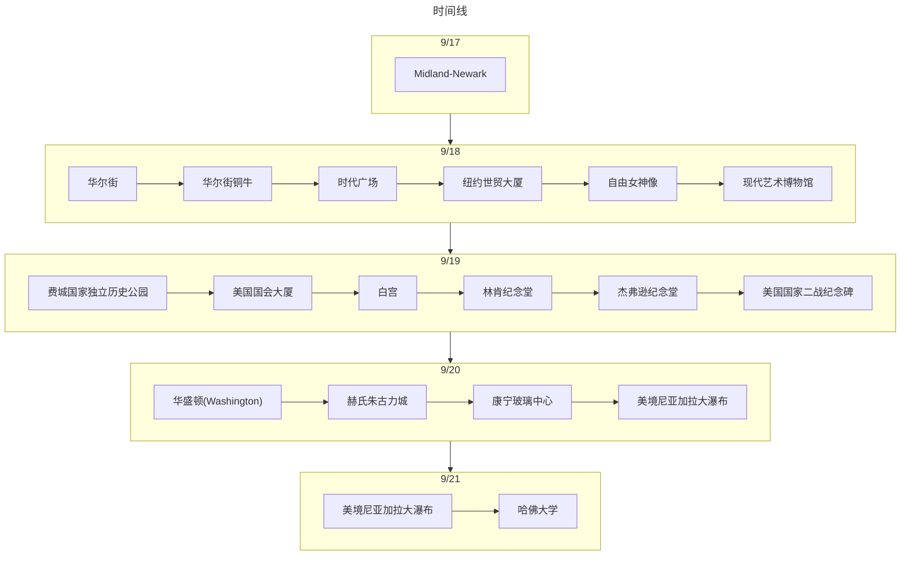

## 2013年9月：美国东岸👣
::::tabs

@tab 总结

::: important 总结
第一次个人出国游，是在2013年赴美实习后参加的。
比较有意思的是这个是“结伴同游”的订单，可以4个人拼当地团
具体费用忘记是多少，只记得每个人团费是199美元，从midland到newark是318.8美元
:::


:::info 旅游花费组成

总共消费是3184.47，包括了1 个人在美国东岸 6 天旅游所有费用。
> 530.75元（每人/每天）
:::

::: echarts

```js
option = {
  tooltip: {
    trigger: "item",
  },
  legend: {
    top: "5%",
    left: "center",
    selectedMode: true,
  },
  series: [
    {
      type: "pie",
      radius: ["40%", "70%"],
      center: ["50%", "70%"],
      startAngle: 180,
      label: {
        show: true,
        formatter(param) {
          return param.name + " (" + param.percent * 2 + "%)";
        },
      },
      data: [
        { value: 1960.62, name: "交通" },
        { value: 1223.85, name: "消费" },
        { value: 0, name: "饮食" },
        { value: 0, name: "住宿" },

        {
          value: 3184.47,
          itemStyle: {
            color: "none",
            decal: {
              symbol: "none",
            },
          },
          label: {
            show: false,
          },
        },
      ],
    },
  ],
};
```

:::

@tab 交通/住宿/饮食

:::important 交通

去程：Midland-Dallas(AA2833)+Dallas-Newark(AA2488)
:::

:::info 住宿
09/17/2013-09/18/2013  Ramada Plaza
09/19/2013  Best Western 或者同等级酒店 
09/20/2013 	Holiday Inn Grand Island 或者同等级酒店 
09/21/2013 Best Western Royal Plaza, Double Tree Boston, Days Hotel 或者同等级酒店 
:::

:::important 饮食
团餐、汉堡为主
:::
@tab 打卡景点列表


:::details 时间线

:::

:::details 景点评价

暂无
:::
::::

