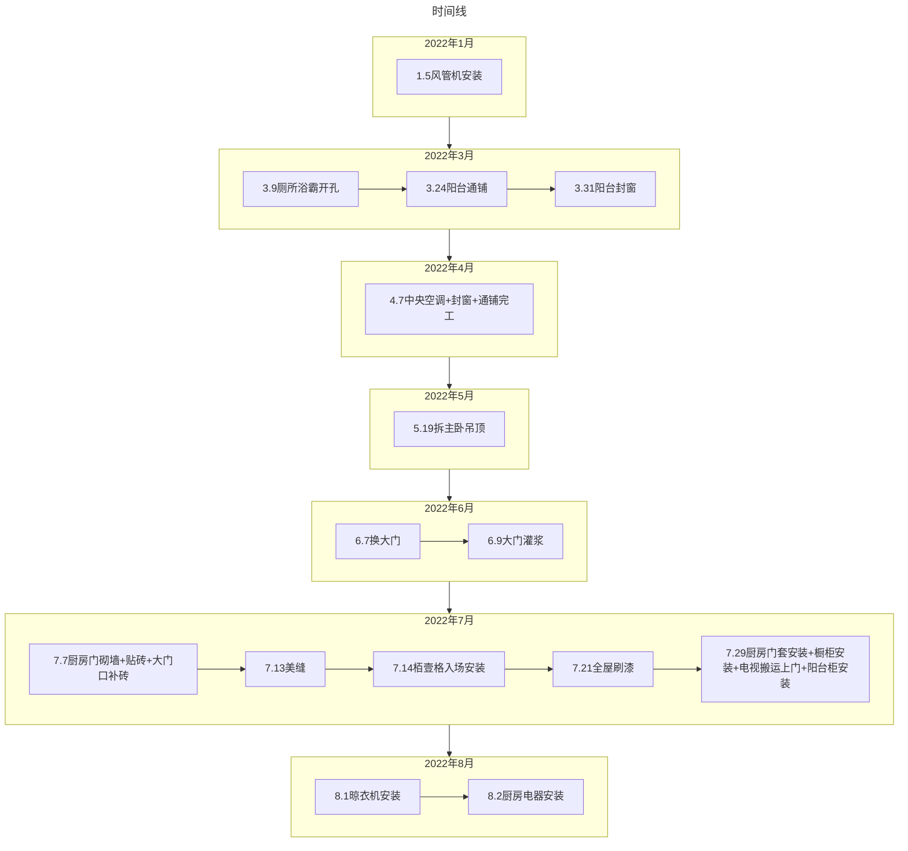

---
# 这是文章的标题
title: 4A1801设计
# 这是页面的图标
icon: house-user
# 设置写作时间
date: 2021-11-17
# 一个页面可以有多个分类
category:
  - Family
# 一个页面可以有多个标签
tag:
  - 家庭
# 此页面会在文章列表置顶
sticky: true
# 此页面会出现在文章收藏中
star: true
# 你可以自定义页脚
#footer: 这是测试显示的页脚
# 你可以自定义版权信息
#copyright: 无版权
---
::: tabs
@tab:active 2021.12.10 收房大吉
<VideoPlayer src="https://4a1801-my.sharepoint.com/personal/arthurfsy_4a1801_onmicrosoft_com/_layouts/15/download.aspx?UniqueId=a0c74679-d31f-4169-a966-6cd79d58c70b&Translate=false&tempauth=eyJ0eXAiOiJKV1QiLCJhbGciOiJIUzI1NiJ9.eyJhdWQiOiIwMDAwMDAwMy0wMDAwLTBmZjEtY2UwMC0wMDAwMDAwMDAwMDAvNGExODAxLW15LnNoYXJlcG9pbnQuY29tQDI3NjVjYjRhLWU0M2MtNDMwMy05MDQ0LTA4MGZhY2UwNTFiZSIsImlzcyI6IjAwMDAwMDAzLTAwMDAtMGZmMS1jZTAwLTAwMDAwMDAwMDAwMCIsIm5iZiI6IjE2OTI0NjU3NjEiLCJleHAiOiIxNjkyNDY5MzYxIiwiZW5kcG9pbnR1cmwiOiJaQnc5T3FnK0NTVzl4YWtEeEFtUXZSUkNtaGQ5bnMzZVVtK0RjaUM0bG5FPSIsImVuZHBvaW50dXJsTGVuZ3RoIjoiMTYyIiwiaXNsb29wYmFjayI6IlRydWUiLCJjaWQiOiJrdG5ZMzJhQ2xFbXRldzJ6b2NZWUN3PT0iLCJ2ZXIiOiJoYXNoZWRwcm9vZnRva2VuIiwic2l0ZWlkIjoiTW1NME4yTTNNbUV0WkRZd1lTMDBZemt5TFRoak1EVXRaVEpqTVRNME9ERmhObVV6IiwiYXBwX2Rpc3BsYXluYW1lIjoiQWxpc3QiLCJnaXZlbl9uYW1lIjoiRmVuZyIsImZhbWlseV9uYW1lIjoiQXJ0aHVyIiwic2lnbmluX3N0YXRlIjoiW1wia21zaVwiXSIsImFwcGlkIjoiMGEyOTkxYTMtMTY3NC00MzM0LTg1NjEtNjcxY2M3MzQ5OTYwIiwidGlkIjoiMjc2NWNiNGEtZTQzYy00MzAzLTkwNDQtMDgwZmFjZTA1MWJlIiwidXBuIjoiYXJ0aHVyZnN5QDRhMTgwMS5vbm1pY3Jvc29mdC5jb20iLCJwdWlkIjoiMTAwMzIwMDI1MUI2MjJBQiIsImNhY2hla2V5IjoiMGguZnxtZW1iZXJzaGlwfDEwMDMyMDAyNTFiNjIyYWJAbGl2ZS5jb20iLCJzY3AiOiJhbGxmaWxlcy53cml0ZSIsInR0IjoiMiIsImlwYWRkciI6IjIwLjE5MC4xNDQuMTcyIn0.wH4Te7aOb6OxITiJmBxZNjxNFM3tNDpc13JTVkA8vr0&ApiVersion=2.0" />

@tab 全屋定制图

<iframe  
 height=600 
 width=100% 
 src="https://720.3vjia.com/S91836485"  
 frameborder=0  
 allowfullscreen>
 </iframe>

@tab 房屋硬装
[房屋硬装改造](https://pan.4a1801.life/Onedrive-4A1801/%E7%85%A7%E7%89%87/%E4%BD%B3%E5%85%86%E4%B8%9A%E5%BE%A1%E6%99%AF%E4%BD%B3%E5%9B%AD%E9%AA%8C%E6%88%BF/%E7%A1%AC%E8%A3%85%E8%AE%B0%E5%BD%95)

 :::

