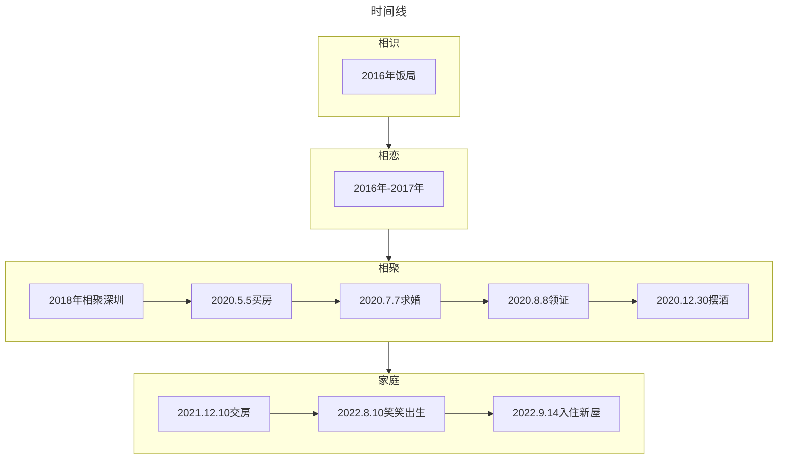

# 关于我们:heart:

# Mr.Feng 与Ms.Wu的故事

::: tip  2016年11月至今的相处与共
:::

::: warning  2016年相识异地恋，2018年同在一座城，2020年领证的小夫妻俩
:::

::: tabs
@tab:active  详情
Ms.Wu的大学好友是Mr.Feng的高中同学，于是相约一场饭局。
那是**16年**深秋的雨夜，地铁站擦肩而过，公交车站躲雨心升好奇，一锅椰子鸡宾客尽欢，从此心中便留下了对方的身影。
**相识**时顿生好感，**相恋**就顺理成章，每天的早安晚安，没日没夜的视频通话，道不尽的是异地相思。
终于在**18年**相聚深圳，一起嘻嘻哈哈一起吵吵闹闹一起浪浪浪，然后一起变胖，做饭刷碗拖地洗衣服，换工作搬家买房相互鼓励跑步运动，终于过上了普通情侣正常的日子。
**2020年**在双方父母的祝福下，决定相守一生，一屋两人三餐四季，足矣。

@tab 时间线

:::

- 打赏二维码:
  ::: tabs
  @tab 支付宝
  
  @tab 微信
  
