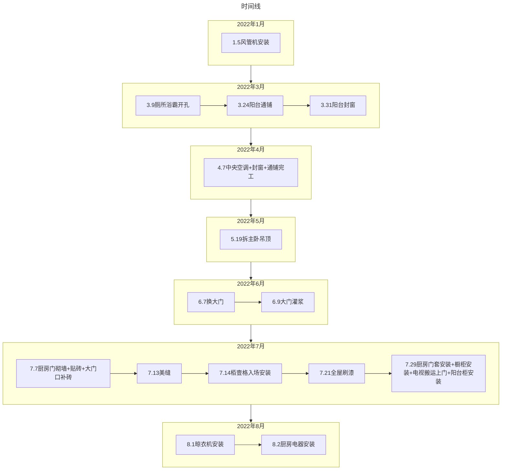

---
# 这是文章的标题
title: 4A1801设计
# 这是页面的图标
icon: house-user
# 设置写作时间
date: 2021-11-17
# 一个页面可以有多个分类
category:
  - Family
# 一个页面可以有多个标签
tag:
  - 家庭
# 此页面会在文章列表置顶
sticky: true
# 此页面会出现在文章收藏中
star: true
# 你可以自定义页脚
#footer: 这是测试显示的页脚
# 你可以自定义版权信息
#copyright: 无版权

order: 3
---
::: tabs
@tab:active 2021.12.10 收房大吉
<VideoPlayer 
src="https://pan.4a1801.life/d/Onedrive-4A1801/%E4%B8%AA%E4%BA%BA%E5%BB%BA%E7%AB%99/assets/article/%E5%AE%B6%E5%BA%AD/2021.12.10%E6%AD%A3%E5%BC%8F%E6%94%B6%E6%88%BF.mp4"
poster="https://pan.4a1801.life/d/Onedrive-4A1801/%E4%B8%AA%E4%BA%BA%E5%BB%BA%E7%AB%99/assets/article/%E5%AE%B6%E5%BA%AD/2021.12.10%E6%94%B6%E6%88%BF%E6%95%B4%E6%94%B9%E9%A1%B9.jpg" />

@tab 全屋定制图

<iframe  
 height=600 
 width=100% 
 src="https://720.3vjia.com/S91836485"  
 frameborder=0  
 allowfullscreen>
 </iframe>

@tab 房屋硬装
[房屋硬装改造](https://pan.4a1801.life/Onedrive-4A1801/%E7%85%A7%E7%89%87/%E4%BD%B3%E5%85%86%E4%B8%9A%E5%BE%A1%E6%99%AF%E4%BD%B3%E5%9B%AD%E9%AA%8C%E6%88%BF/%E7%A1%AC%E8%A3%85%E8%AE%B0%E5%BD%95)

 :::
