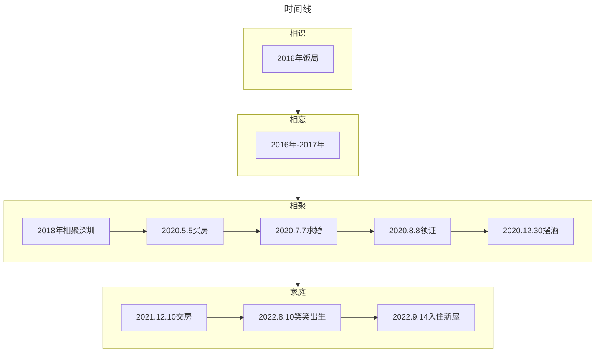

# 关于我们 ❤️

## Mr.Feng 与 Ms.Wu 的故事

::: tip 从何开始
2016 年 11 月至今的相处与共
:::

::: info 一句话的时间线
2016 年相识异地恋，2018 年同在一座城，2020 年领证的小夫妻俩，2023 年新手妈妈和爸爸+笑笑大宝贝
:::

::: tabs
@tab:active 详情
Ms.Wu 的大学好友是 Mr.Feng 的高中同学，于是相约一场饭局。

那是**16 年**深秋的雨夜，地铁站擦肩而过，公交车站躲雨心升好奇，一锅椰子鸡宾客尽欢，从此心中便留下了对方的身影。

**相识**时顿生好感，**相恋**就顺理成章，每天的早安晚安，没日没夜的视频通话，道不尽的是异地相思。

终于在**18 年**相聚深圳，一起嘻嘻哈哈一起吵吵闹闹一起浪浪浪，然后一起变胖，做饭刷碗拖地洗衣服，换工作搬家买房相互鼓励跑步运动，终于过上了普通情侣正常的日子。

**2020 年**在双方父母的祝福下，决定相守一生，一屋两人三餐四季，足矣。

**2023 年**笑笑出生，从此幸福的二人世界变成了幸福的一家三口。

@tab 时间线

:::

## 联系我们

> 欢迎“遗失”的亲朋好友“找回”我！

::: tabs
@tab 微信

@tab QQ

@tab 手机

:::center

> 笑笑的手机号是她的生日，然后手机卡暂借给他爸插到车机上当流量卡了

:::

## 打赏二维码

::: tabs
@tab 支付宝

@tab 微信

:::

## 我们的“关键字”

