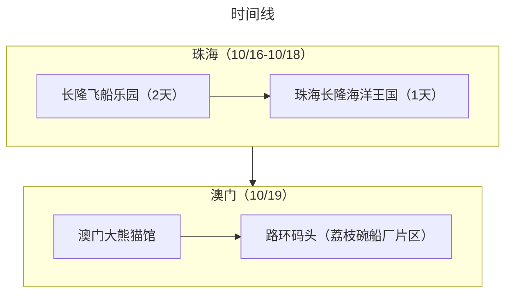
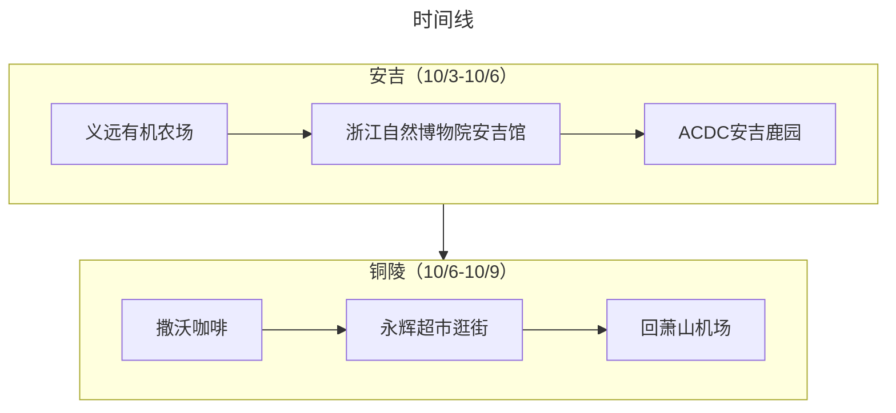
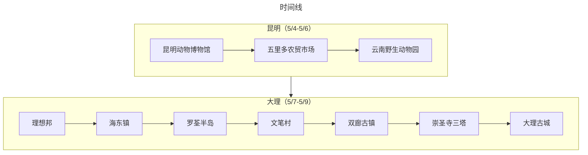
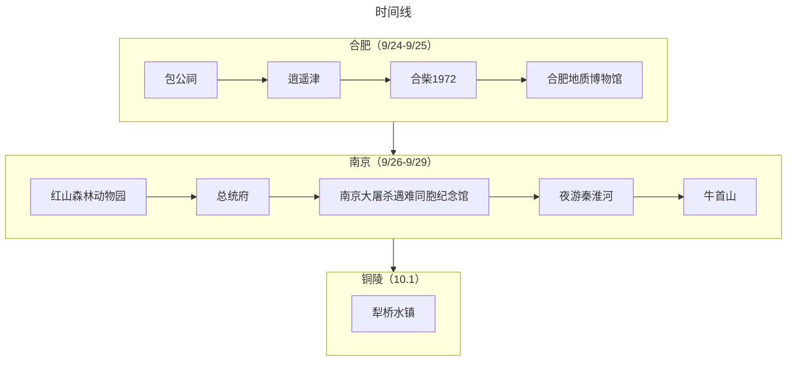
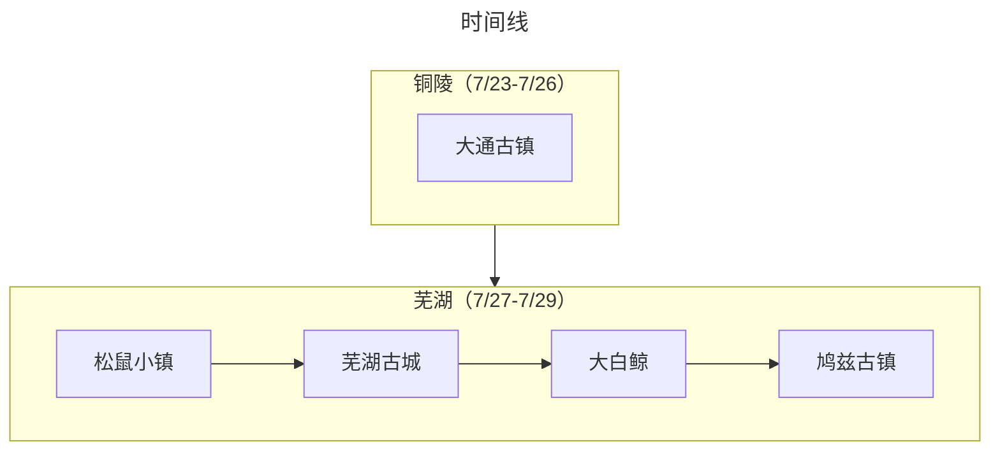
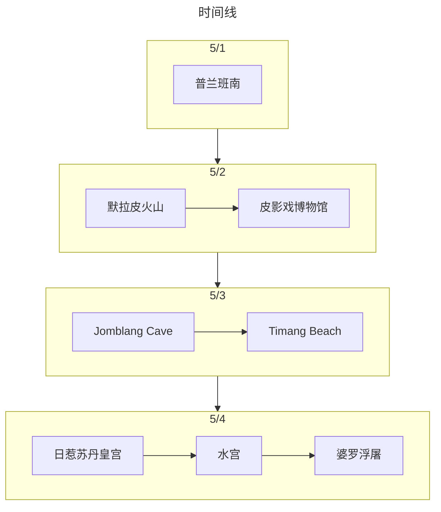
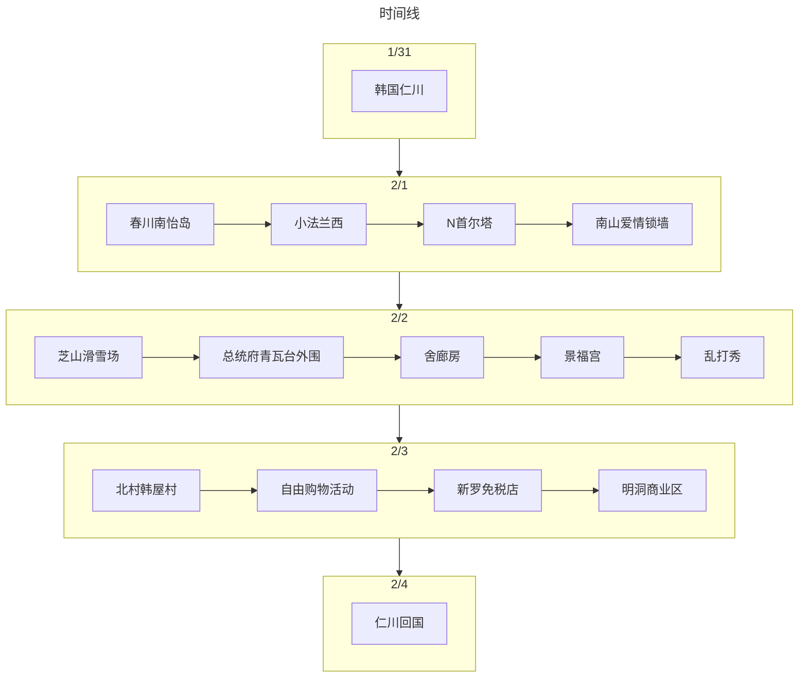
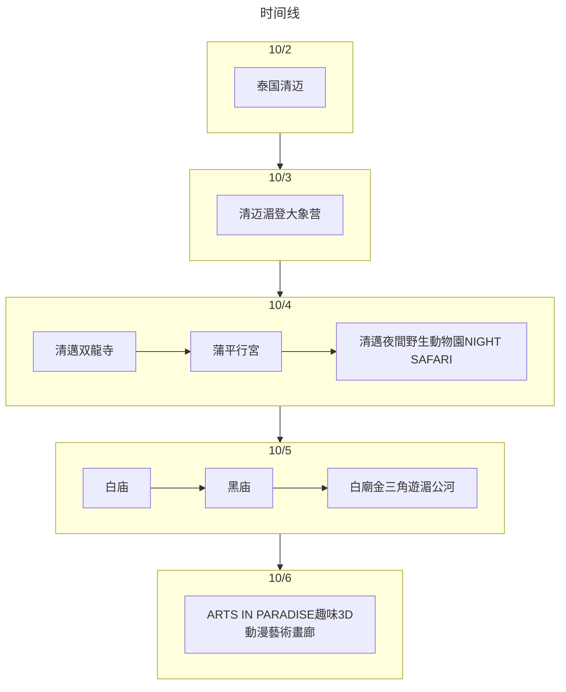

## 旅行足迹
<iframe 
src="https://arthurfsy2.github.io/footprintFamily/index.html" 
frameborder=0
height=500
width=100%
seamless=seamless
scrolling=auto
></iframe>

## 2025年10月：珠海+澳门👣
::::tabs

@tab 总结

::: important 总结
本次出行是自驾的方式，“错峰出行”玩了珠海+澳门两地。行程安排得很松弛，飞船酒店的住宿额外满意，澳门也挖掘了除了“娱乐场”以外的亲子玩法。
:::


:::info 旅游花费组成

总共消费是7228.32，包括了 3 大 1 小在珠海+澳门 4 天旅游所有费用。
> 451.77元（每人/每天）
:::

::: echarts

```js
option = {
  tooltip: {
    trigger: "item",
  },
  legend: {
    top: "5%",
    left: "center",
    selectedMode: true,
  },
  series: [
    {
      type: "pie",
      radius: ["40%", "70%"],
      center: ["50%", "70%"],
      startAngle: 180,
      label: {
        show: true,
        formatter(param) {
          return param.name + " (" + param.percent * 2 + "%)";
        },
      },
      data: [
        { value: 564.38, name: "交通" },
        { value: 2160.55, name: "消费" },
        { value: 2378.59, name: "饮食" },
        { value: 2124.8, name: "住宿" },

        {
          value: 7228.320000000001,
          itemStyle: {
            color: "none",
            decal: {
              symbol: "none",
            },
          },
          label: {
            show: false,
          },
        },
      ],
    },
  ],
};
```

:::

@tab 交通/住宿/饮食

:::important 交通

第一天直接从家自驾到飞船酒店，在最后一天去澳门全程是轻轨+公交，整体交通费用不多。
澳门可以在横琴口岸直接坐轻轨到达石排湾（但是要换乘几次），费用相对港铁也便宜很多
:::

:::info 住宿
旅游总共住了3个晚上。
10.16-10.17 长隆飞船酒店（★★★★★）：飞船房免费升级到了亲子星辰房，感觉特别划算，房间有滑滑梯和一个“小船”房间，笑笑很喜欢

10.18 Dreamer雲享公寓（★★⚝⚝⚝）：近横琴口岸的一个公寓，房间内不是很新，望远镜也坏了，外面的卫生也不太行，走廊有烟味，除了近没有啥优点。
:::

:::important 饮食
- 第一顿打卡了`颓记`（★★★⚝⚝），感觉也就那样吧
- 在飞船酒店吃了2次自助（★★★★★）（午餐+晚餐），很满意海鲜的质量（尤其是蒸生蚝）
- 圆满海南鸡饭（★★★⚝⚝），一家人只有我比较合口味
- 澳门陆环码头面馆（★★★★★），点了捞面、汤面、盖饭，都很不错！不禁感慨一分钱一分货啊
- 澳门安德鲁饼店（★★★★★），蛋挞在热的时候很好吃！旁边的安德鲁咖啡馆也打卡了甜点，也很不错，很细腻的口感
:::
@tab 打卡景点列表


:::details 时间线

:::

:::details 景点评价

### 珠海（10/16-10/18）
#### 10/16-10/17：
长隆飞船乐园（★★★★⚝）：玩了2天。几乎全室内，很适合怕晒怕热的小朋友和爸妈。有飞船多的机动游戏可以畅玩，还有虎鲸表演。但是对孕妇不是很友好，没啥可以陪同的项目


#### 10/18：
珠海长隆海洋王国（★★⚝⚝⚝）：玩了半天，由于是室外，中午去感觉很热，而且算是比较老的项目了，很多设备都在维修。


### 澳门（10/19）
澳门大熊猫馆（★★★★★）：可以看到大熊猫，熊猫馆还有一个文创商店，可以DIY熊猫玩偶。路环码头附近也有很多网红店值得打卡

荔枝碗船厂片区（★★★★★）：在路环码头步行可以到达，有很多小朋友玩的户外设施，也有一个很大的攀爬架，但是笑笑没到年龄不能玩

:::

@tab 旅游视频
:::important 视频
<VidStack
src="https://pan.4a1801.life:11443/d/public/article/%E5%AE%B6%E5%BA%AD/%E7%AC%91%E7%AC%91%E6%88%90%E9%95%BF/3-4%E5%B2%81/202510%E7%8F%A0%E6%B5%B7.mp4"
/>

:::
::::


## 2024年10月：安吉+铜陵👣
::::tabs

@tab 总结

::: important 总结
本次出行是采用飞机+当地租车的方式，“半个错峰出行”玩了安吉+铜陵两地。行程安排得很松弛，不过整体旅游感觉还是比较满意。
:::


:::info 旅游花费组成

总共消费是14122.71，包括了 2 大 1 小在安吉+铜陵 7 天旅游所有费用。
> 672.51元（每人/每天）
:::

::: echarts

```js
option = {
  tooltip: {
    trigger: "item",
  },
  legend: {
    top: "5%",
    left: "center",
    selectedMode: true,
  },
  series: [
    {
      type: "pie",
      radius: ["40%", "70%"],
      center: ["50%", "70%"],
      startAngle: 180,
      label: {
        show: true,
        formatter(param) {
          return param.name + " (" + param.percent * 2 + "%)";
        },
      },
      data: [
        { value: 5915.4, name: "交通" },
        { value: 3201.43, name: "消费" },
        { value: 3005.88, name: "饮食" },
        { value: 2000, name: "住宿" },

        {
          value: 14122.71,
          itemStyle: {
            color: "none",
            decal: {
              symbol: "none",
            },
          },
          label: {
            show: false,
          },
        },
      ],
    },
  ],
};
```

:::

@tab 交通/住宿/饮食

:::important 交通

旅游首站是杭州，直接从深圳坐飞机抵达萧山机场。之前是已经在神州租车下了 6 天的订单，所以很快就在交通中心提车了。后面的所有景点都是通过自驾的方式游玩，在10.9直接从铜陵开车回萧山机场，耗时约345公里（5个小时）
:::

:::info 住宿
其实住宿的自费费用只包含了在安吉的 3 个晚上，花了2000租了一个美式风格的民宿，算下来要 666 元/晚，算比较贵的了，不过总体来说也算挺满意的，房间有一个大浴缸，方便笑笑洗澡，然后楼下还养了几只大猫咪，笑笑很喜欢和它们一起玩
:::

:::important 饮食
感觉杭州、安吉的饮食很适合我这个“广东胃”，整体咸淡适中，味道也挺不错的。但是咖啡水准一般，且网红打卡的餐厅价格都偏贵，安吉的 2-4 人餐是在 300-400 一顿之间。
:::
@tab 打卡景点列表


:::details 时间线

:::

:::details 景点评价

### 安吉（10/3-10/6）
#### 10/4：
义远有机农场（★★★★⚝）：一个低龄宝宝很喜欢的牧场。有山羊、奶牛、小鸭子、小猪等常见的农场动物可以投喂和拍照，地方很大，适合休闲放空。


#### 10/5：
浙江自然博物院安吉馆（★★★★⚝）：果然是超级大的博物馆，有很多个分馆，每个分馆对应不同的主题。但是实在太大了，导致笑笑走到后面都走不动路。


#### 10/6：
ACDC 安吉鹿园（★★★⚝⚝）：有很多可爱的小鹿可以投喂，地方不大，适合闲逛拍照，门票和附近的咖啡馆消费相对较高，鹿园里面的消费倒是相对正常。

:::

@tab 旅游视频
:::important 视频
<VidStack
src="https://pan.4a1801.life:11443/d/public/article/%E5%AE%B6%E5%BA%AD/%E7%AC%91%E7%AC%91%E6%88%90%E9%95%BF/2-3%E5%B2%81/2024%E5%9B%BD%E5%BA%86%E5%87%BA%E6%B8%B8.mp4"
/>

:::
::::


## 2024年5月：昆明+大理👣
::::tabs

@tab 总结

::: important 总结
本次出行是采用飞机+当地租车的方式，“半个错峰出行”玩了昆明+大理两地。行程安排得很松弛，感觉在昆明玩得不是很尽兴，在大理环洱海自驾感觉还不错
:::


:::info 旅游花费组成

总共消费是9459.80，包括了 2 大 1 小在昆明+大理 6 天旅游所有费用。
> 525.54元（每人/每天）
:::

::: echarts

```js
option = {
  tooltip: {
    trigger: "item",
  },
  legend: {
    top: "5%",
    left: "center",
    selectedMode: true,
  },
  series: [
    {
      type: "pie",
      radius: ["40%", "70%"],
      center: ["50%", "70%"],
      startAngle: 180,
      label: {
        show: true,
        formatter(param) {
          return param.name + " (" + param.percent * 2 + "%)";
        },
      },
      data: [
        { value: 4333.39, name: "交通" },
        { value: 1485.37, name: "消费" },
        { value: 1449.1, name: "饮食" },
        { value: 2191.94, name: "住宿" },

        {
          value: 9459.8,
          itemStyle: {
            color: "none",
            decal: {
              symbol: "none",
            },
          },
          label: {
            show: false,
          },
        },
      ],
    },
  ],
};
```

:::

@tab 交通/住宿/饮食

:::important 交通

旅游首站是昆明，去程比较曲折，因为下雨飞机晚点3个小时才到昆明。然后5.7在大理租了2天的车，大交通+自驾租车+油费大概是 4300+
:::

:::info 住宿
旅游总共住了5个晚上，全部在不同的酒店入住，收拾行李果然很麻烦。
5.4-5.5 昆明君乐酒店（★★⚝⚝⚝）：房间老旧，服务态度很好，整体不是很满意
5.5-5.6 云南维居金鹰大酒店（★★★★⚝）：有儿童专用的浴盆、洗浴用具，很不错
5.6-5.7 桔子水晶：（★★★⚝⚝）：有2.4的大床，整体不错
5.7-5.8 双廊民宿（★★⚝⚝⚝）：在上山，附近在修房子，整体不太满意
5.8-5.9 大理洱海龙湾假日酒店（★★★★⚝）：性价比很高的loft，整体满意，但是楼上2个房间没有空调
:::

:::important 饮食
感觉2个城市的消费还好，随便一家米线兜不踩雷。
水果非常实惠（尤其是蓝莓）
菌菇火锅个人感觉一般，性价比不太高（可以类比深圳海鲜街大排档，昂贵的菌菇犹如昂贵的海鲜）
其他在古城的饮食也不算特别贵
:::
@tab 打卡景点列表


:::details 时间线

:::

:::details 景点评价

### 昆明（5/4-5/9）

#### 5/4：

飞机晚点了，到了酒店附近的翠湖公园逛了一会儿会儿，顺便找了街边的米线馆吃米线


#### 5/5：

昆明动物博物馆（★★★⚝⚝）：门票30元/人，内部都是动物标本，的确挺逼真的，但是地方不大，大概逛了2个小时久下来了


#### 5/6：

云南野生动物园（★★★⚝⚝）：一个“观赏距离很近”的动物园，可以近距离看到各种动物，尤其是被一大群孔雀包围的感觉很神奇。整个动物园还挺大的，做观光车都要10公里


### 大理（5/7-5/9）

#### 5/7：

洱海（★★★★⚝）：绕了洱海自驾了一周，风景真的好看，随处看到开敞篷车、骑自行车、电动车、徒步的人，即使不是五一的高峰期也非常有人气。

<VidStack 
src="https://ak-v.tripcdn.com/videos/R30ucn14x8ttpws1707A5.mp4" 
poster="https://ak-d.tripcdn.com/images/100p0h0000008s7xqA6E5_C_1200_800_Q70.jpg"
/>

文笔村（★★★★⚝）：开车路过的一个地方，路面经常看到彩虹般的颜色，挺适合休闲的，尽头还有人在卖咖啡


双廊古镇（★★★⚝⚝）：一个比较常见和普通的古镇

<VidStack 
src="https://ak-v.tripcdn.com/videos/R30gcn1a0dh3k7bww5D19.mp4" 
poster="https://ak-d.tripcdn.com/images/01069120008fjx3hp1920_C_1200_800_Q70.jpg"
/>

崇圣寺三塔（★★⚝⚝⚝）：订酒店时送的门票，感觉一般般

:::
::::


## 2023年9月：合肥+南京+铜陵👣
::::tabs

@tab 总结

::: important 总结
本次出行是采用飞机+当地租车的方式，“半个错峰出行”玩了合肥-南京-铜陵三地。总体而言由于带娃出行，因此行程安排得很松弛，最后顺带回铜陵娘家也玩了一个小景点（犁桥水镇）。
:::


:::info 旅游花费组成

总共消费是16307.18，包括了 3 大 1 小在合肥+南京+铜陵 10 天旅游所有费用。
> 407.68元（每人/每天）
:::

::: echarts

```js
option = {
  tooltip: {
    trigger: "item",
  },
  legend: {
    top: "5%",
    left: "center",
    selectedMode: true,
  },
  series: [
    {
      type: "pie",
      radius: ["40%", "70%"],
      center: ["50%", "70%"],
      startAngle: 180,
      label: {
        show: true,
        formatter(param) {
          return param.name + " (" + param.percent * 2 + "%)";
        },
      },
      data: [
        { value: 8466.47, name: "交通" },
        { value: 1882.48, name: "消费" },
        { value: 3243.83, name: "饮食" },
        { value: 2714.4, name: "住宿" },

        {
          value: 16307.18,
          itemStyle: {
            color: "none",
            decal: {
              symbol: "none",
            },
          },
          label: {
            show: false,
          },
        },
      ],
    },
  ],
};
```

:::

@tab 交通/住宿/饮食

:::important 交通

旅游首站是合肥，直接从深圳坐飞机过去，然后合肥机场有神州租车的点。之前是已经在神州租车下了 9 天的订单，所以很快就提车了。后面的所有景点都是通过自驾的方式游玩。大交通+自驾租车+油费大概是 8400+
:::

:::info 住宿
其实住宿的自费费用只包含了在南京的 4 个晚上，是租了一个 2 房 2 厅 2 卫的民宿套房，算下来要 680 元/晚，算比较贵的了，不过总体来说也算挺满意的，只是因为民俗是在夫子庙那一块，停车不太方便，基本都是靠路边停车，还被南京的交警开了 1 次罚单，幸好是首违免罚。
:::

:::important 饮食
感觉合肥的消费还好，南京的网红打卡的餐厅价格都偏贵，南京的 3-4 人餐是在 250-500 一顿之间，感觉南京大牌档的性价比会高一点。
:::
@tab 打卡景点列表


:::details 时间线

:::

:::details 景点评价

### 合肥（9/24-9/25）

#### 9/24：

早上赶了早班飞机到了合肥，去了包公祠和逍遥津。

包公祠（★★⚝⚝⚝）：普普通通吧，然后带着娃从包公祠走路 2 公里到逍遥津，期间路过了步行街非常多人，热闹得很，就是“负重”2 公里实在太费爹妈了。

<VidStack 
src="https://ak-v.tripcdn.com/videos/K70q27000001i6vmv835F.mp4" 
poster="https://ak-d.tripcdn.com/images/01053120005wr7vq7A738.jpg"
/>

逍遥津（★★★⚝⚝）：给我感觉是一个公园+游乐场的地方，有很多小朋友的娱乐项目，笑笑在这里玩了旋转木马。

<VidStack 
src="https://ak-v.tripcdn.com/videos/K70427000001i4kkp3DA9/mp4" 
poster="https://ak-d.tripcdn.com/images/0100i1200089iyocwDA2A.jpg"
/>

#### 9/25：

合柴 1972（★★★★⚝）：由旧监狱改造的文创园，园区很大，适合大小朋友玩。里面的蒸汽小火车、家电博物馆、District Coffee 都很不错。拍照也很能出片。最关键是还有猫咖，笑笑看了贼兴奋。个人感觉消费水平是中高


#### 9/26：

合肥地质博物馆（★★★⚝⚝）：一个“批了地质博物馆外皮的恐龙博物馆”，其中有好几层是恐龙的介绍，小朋友也挺喜欢的。


### 南京（9/26-9/29）

#### 9/27：

南京市红山森林动物园（★★★★★）：一个动物种群丰富、以“动物为本”的亲子乐园。很喜欢动物园里随处可见的“请勿投喂动物”、拒绝动物表演的标识，比起其他动物园的“有偿”投喂动物好多了。而且这里有很多很好看的盖章！（开启了南京盖章之旅）


#### 9/28：

总统府（★★★⚝⚝）：个人感觉是一个大公园，里面有可爱的“府猫”，任人随意撸，这一点很爽。

<VidStack 
src="https://ak-v.tripcdn.com/videos/K70j26000001i4vte8608.mp4?ts=1658130220376" 
poster="https://ak-d.tripcdn.com/images/1A0b15000000y90y97885.jpg"
/>

侵华日军南京大屠杀遇难同胞纪念馆（★★★★★）：没有一个中国人能平静地离开这个地方。实在是太残酷了，每个中国人都应该去这里看看，勿忘国耻！


夜游秦淮河（★★★★⚝）：秦淮河夜景挺漂亮的，终于来到了“商女不知亡国恨，隔江犹唱后庭花”中的秦淮河，游船价格稍贵，是 100 元/人。


#### 9/29

牛首山（★★★⚝⚝）：一个以佛教为主题的风景区。5 层地宫+睡佛很宏伟震撼，素面也很好吃。推荐信佛人士。


### 铜陵（10.1）

犁桥水镇（★★★★⚝）：一个新建的风景小镇。虽然饮食也和其他商业化古镇差不多，但是里面的服务人员态度很好，里面的一家咖啡馆也、小邮局也都还不错。但是因为是铜陵最近的“爆款”景点，导致来的人太多了，停车也很难停。出入口位置也小，导致进出水镇的人都挤一块去了。如果是淡季来，估计可以闲逛闲逛，感觉会舒服一点。

:::

@tab 旅游视频
:::important 视频
<VidStack
src="https://pan.4a1801.life:11443/d/public/article/%E5%AE%B6%E5%BA%AD/%E7%AC%91%E7%AC%91%E6%88%90%E9%95%BF/1-2%E5%B2%81/2023%E5%9B%BD%E5%BA%86%E8%8A%82%E5%87%BA%E6%B8%B8.mp4"
/>

:::
::::


## 2023年7月：铜陵+芜湖👣
::::tabs

@tab 总结

::: important 总结
本次出行是采用飞机+当地租车的方式，“回娘家试出行”玩了铜陵+芜湖两地。由于是第一次带娃出远门，因此行程安排得非常松弛。
:::


:::info 旅游花费组成

总共消费是10284.98，包括了2大1小在铜陵+芜湖 8 天旅游所有费用。
> 428.54元（每人/每天）
:::

::: echarts

```js
option = {
  tooltip: {
    trigger: "item",
  },
  legend: {
    top: "5%",
    left: "center",
    selectedMode: true,
  },
  series: [
    {
      type: "pie",
      radius: ["40%", "70%"],
      center: ["50%", "70%"],
      startAngle: 180,
      label: {
        show: true,
        formatter(param) {
          return param.name + " (" + param.percent * 2 + "%)";
        },
      },
      data: [
        { value: 7514.46, name: "交通" },
        { value: 895.67, name: "消费" },
        { value: 217, name: "饮食" },
        { value: 1657.85, name: "住宿" },

        {
          value: 10284.98,
          itemStyle: {
            color: "none",
            decal: {
              symbol: "none",
            },
          },
          label: {
            show: false,
          },
        },
      ],
    },
  ],
};
```

:::

@tab 交通/住宿/饮食

:::important 交通

旅游首站是铜陵，直接从深圳坐飞机过去，然后九华山机场有神州租车的点。之前是已经在神州租车下了8天的订单，所以很快就提车了。后面的所有景点都是通过自驾的方式游玩。大交通+自驾租车+油费大概是7500+
:::

:::info 住宿
其实住宿的自费费用只包含了在芜湖的2个晚上，分别在华邑酒店、新华联丽景酒店住了一晚，都是酒店+自助+景点门票的形式，但都算入了“住宿”类别。
:::

:::important 饮食
感觉芜湖的消费还好，路边小馆子吃得不少，花费不是很多
:::
@tab 打卡景点列表


:::details 时间线

:::

:::details 景点评价

### 铜陵（7/23-7/26）

#### 7/25：


大通古镇（★★★⚝⚝）：全国独有的江豚保护区，可以体验“轮渡”，中午饭是在大通古镇上面吃的，遇到了一个同是来自由行的一家人，好客的大哥还邀请我们同桌吃饭，因此是“免费的午餐”。


### 芜湖（7/27-7/29）

#### 7/27：

松鼠小镇（★★★★⚝）：一个小动物园+游乐场+闲逛的地方，笑笑在这里第一次坐摩天轮。


#### 7/28：

芜湖古城（★★★⚝⚝）：一个比较新的商业化古城，笑笑喜欢吃耿福星的鸡丝面。


#### 7/29：

芜湖新华联大白鲸海洋公园（★★★★⚝）：一个一开始以为普普通通，实际上内部很大，很多地方可以参观的地方。以大白鲸为主题，也可以看到很多水生动植物。


鸠兹古镇（★★★⚝⚝）：就在大白鲸海洋公园边上的古镇，地方非常大，当时还租了一辆小电动观光车，现在看来是明智之举。可能是因为中午去的原因，天气比较热，地方也显得有点空旷，没啥项目可以互动。


:::
::::


## 2019年5月：印尼日惹👣
::::tabs

@tab 总结

::: important 总结
印尼日惹是冯先生和吴女士第一次出国+自由行，事前做了 N 多的攻略 ，是一次记忆非常深刻而且很有意义的旅行。
:::


:::info 旅游花费组成

总共消费是13228.16，包括了2 个人在印尼日惹 4 天旅游所有费用。
> 1653.52元（每人/每天）
:::

::: echarts

```js
option = {
  tooltip: {
    trigger: "item",
  },
  legend: {
    top: "5%",
    left: "center",
    selectedMode: true,
  },
  series: [
    {
      type: "pie",
      radius: ["40%", "70%"],
      center: ["50%", "70%"],
      startAngle: 180,
      label: {
        show: true,
        formatter(param) {
          return param.name + " (" + param.percent * 2 + "%)";
        },
      },
      data: [
        { value: 7426, name: "交通" },
        { value: 4048.48, name: "消费" },
        { value: 375.68, name: "饮食" },
        { value: 1378, name: "住宿" },

        {
          value: 13228.16,
          itemStyle: {
            color: "none",
            decal: {
              symbol: "none",
            },
          },
          label: {
            show: false,
          },
        },
      ],
    },
  ],
};
```

:::

@tab 交通/住宿/饮食

:::important 交通

飞机票是此次旅行的大头，约占了总费用的一半。我们去的时候是从深圳-雅加达-日惹，其中因为深圳-雅加达晚点了，因为机票是分开 2 个行程买的，坑爹携程不能退票或改签雅加达-日惹的行程，因此到了雅加达后，只能重新现场买票。然后到达当地主要是靠 Grab 网约车，线上叫车，线下付车费的方式。后面去天坑的时候花了 200 元找了 Love Engine 这家当地旅行社包了一辆车，他们家的无人机拍摄太出片了！
:::

:::info 住宿
其实日惹的住宿算是性价比很高了，5.1-5.3 入住了凯悦日惹酒店，5.3-5.4 入住日惹菲尼克斯美憬阁酒店，酒店都非常有特色，而且环境很棒。还记得日惹菲尼克斯美憬阁酒店的小酒吧点了一杯 mojito 尝试了一下。

:::

:::important 饮食
日惹的饮食还挺有特色的，不过为了照顾我们的“中国胃”，我们一般选择了西餐、海鲜餐等。不过因为大多数是用当地货币付款，少数是刷信用卡付款，因此饮食大部分列入到了“消费”类别。
PS：印象中记得 Roaster and Bear 这家西餐厅味道还不错，Jejamuran 这家蘑菇做得很有特色。


:::
@tab 打卡景点列表


:::details 时间线

:::

:::details 景点评价

### 日惹（5/1-5/4）

#### 5/1：

普兰班南（★★★⚝⚝）：很有独特韵味的寺庙，很出片。不过针对外国人的门票比较贵


#### 5/2：

默拉皮火山（★★★★⚝）：在半山腰找了一家 Jeep 车公司(Merapi Jeep Land Cruiser)租车，去参观了遇难者纪念馆。挺有意义的。后面因为我们下山的时候叫不到车，还是司机小哥帮我们约了车。


皮影戏博物馆（★★★★⚝）：晚上去的，很有老手艺人的感觉，可惜皮影戏的剧情看得不是太懂。看完后还在路边买了 2 个椰子喝，顺带用 Google translate 和当地的老奶奶有一句没一句地聊天。


#### 5/3：

Jomblang Cave（★★★★★）：第一次进入洞穴探险，真的很神奇。是通过人力来进行升降进出洞穴，下降后通过泥泞的小路后可以看到里面有类似溶洞的地方，还可以看到“神圣”的光撒进洞穴内部。


Timang Beach（★★★★★）：离日惹有几个小时的车程，是一个独立在海岸边的小礁石，通过吊车、索桥进出。看海景真的非常棒！但是对于有点恐高的我是一个挑战。一到这里就有很上道的小哥过来说帮忙拍照，后面给他一点小费。然后玩完后，去吃了一顿龙虾大餐。


#### 5/4：

日惹苏丹皇宫（★★⚝⚝⚝）：印象不深的地方

水宫（★★★⚝⚝）：有很多小巷子，适合拍照

婆罗浮屠（★★★★⚝）：和普兰班南类似的寺庙群，不过地方挺大的


:::
::::


## 2016年1月：韩国首尔+江原道+京畿道+仁川👣
::::tabs

@tab 总结

::: important 总结
第2次和爸妈出国游，还记得当时是临近春节，从韩国回到深圳后，由于深圳没有飞机，只能打车到广州白云机场飞海口，回海口后还感冒了
由于是报团游，所以费用无法拆分，放到了“消费”当中
:::


:::info 旅游花费组成

总共消费是15417.00，包括了3 个人在韩国首尔+江原道+京畿道+仁川 5 天旅游所有费用。
> 1027.8元（每人/每天）
:::

::: echarts

```js
option = {
  tooltip: {
    trigger: "item",
  },
  legend: {
    top: "5%",
    left: "center",
    selectedMode: true,
  },
  series: [
    {
      type: "pie",
      radius: ["40%", "70%"],
      center: ["50%", "70%"],
      startAngle: 180,
      label: {
        show: true,
        formatter(param) {
          return param.name + " (" + param.percent * 2 + "%)";
        },
      },
      data: [
        { value: 0, name: "交通" },
        { value: 15417, name: "消费" },
        { value: 0, name: "饮食" },
        { value: 0, name: "住宿" },

        {
          value: 15417.0,
          itemStyle: {
            color: "none",
            decal: {
              symbol: "none",
            },
          },
          label: {
            show: false,
          },
        },
      ],
    },
  ],
};
```

:::

@tab 交通/住宿/饮食

:::important 交通

去程：国际航班 OZ 372
回程：国际航班 OZ 371
:::

:::info 住宿
首尔 COEX 洲际酒店(韩国五花特一级酒店) 4晚
:::

:::important 饮食
主要是团餐，比如烤肉
:::
@tab 打卡景点列表


:::details 时间线

:::

:::details 景点评价

太过久远，只找到[通知书](/assets/pdf/旅游/韩国出团通知书.pdf)的介绍
:::
::::


## 2015年10月：泰国清迈+清萊👣
::::tabs

@tab 总结

::: important 总结
第1次和爸妈出国游，具体费用忘记是多少了，只能查到携程机票去程是14499
当时是找了依琳推荐的地陪
:::


:::info 旅游花费组成

总共消费是14499.00，包括了3 个人在泰国清迈+清萊 6 天旅游所有费用。
> 805.5元（每人/每天）
:::

::: echarts

```js
option = {
  tooltip: {
    trigger: "item",
  },
  legend: {
    top: "5%",
    left: "center",
    selectedMode: true,
  },
  series: [
    {
      type: "pie",
      radius: ["40%", "70%"],
      center: ["50%", "70%"],
      startAngle: 180,
      label: {
        show: true,
        formatter(param) {
          return param.name + " (" + param.percent * 2 + "%)";
        },
      },
      data: [
        { value: 14499, name: "交通" },
        { value: 0, name: "消费" },
        { value: 0, name: "饮食" },
        { value: 0, name: "住宿" },

        {
          value: 14499.0,
          itemStyle: {
            color: "none",
            decal: {
              symbol: "none",
            },
          },
          label: {
            show: false,
          },
        },
      ],
    },
  ],
};
```

:::

@tab 交通/住宿/饮食

:::important 交通

去程：广州-清迈（CZ8539)
:::

:::info 住宿
清迈 Holiday Inn 4晚
PS：地陪给我们托人免费升级套房，不到300RMB一晚
:::

:::important 饮食
各种热带水果、芒果饭、海鲜等
:::
@tab 打卡景点列表


:::details 时间线

:::

:::details 景点评价

暂无
:::
::::

