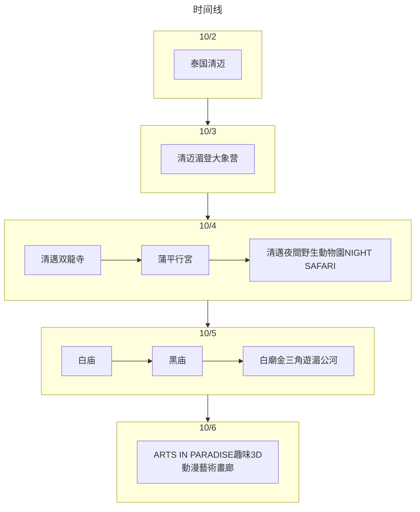

:::tip 总结

第1次和爸妈出国游，具体费用忘记是多少了，只能查到携程机票去程是14499
当时是找了依琳推荐的地陪
:::

## 旅游花费组成

总共消费是14499.00，包括了3 个人在泰国清迈+清萊 6 天旅游所有费用。
> 805.5元（每人/每天）

::: echarts

```js
option = {
  tooltip: {
    trigger: "item",
  },
  legend: {
    top: "5%",
    left: "center",
    selectedMode: true,
  },
  series: [
    {
      type: "pie",
      radius: ["40%", "70%"],
      center: ["50%", "70%"],
      startAngle: 180,
      label: {
        show: true,
        formatter(param) {
          return param.name + " (" + param.percent * 2 + "%)";
        },
      },
      data: [
        { value: 14499, name: "交通" },
        { value: 0, name: "消费" },
        { value: 0, name: "饮食" },
        { value: 0, name: "住宿" },

        {
          value: 14499.0,
          itemStyle: {
            color: "none",
            decal: {
              symbol: "none",
            },
          },
          label: {
            show: false,
          },
        },
      ],
    },
  ],
};
```

:::

## 交通

去程：广州-清迈（CZ8539)

## 住宿

清迈 Holiday Inn 4晚
PS：地陪给我们托人免费升级套房，不到300RMB一晚

## 饮食

各种热带水果、芒果饭、海鲜等

## 打卡景点列表

:::tabs
@tab:active 时间线



@tab 景点评价

暂无