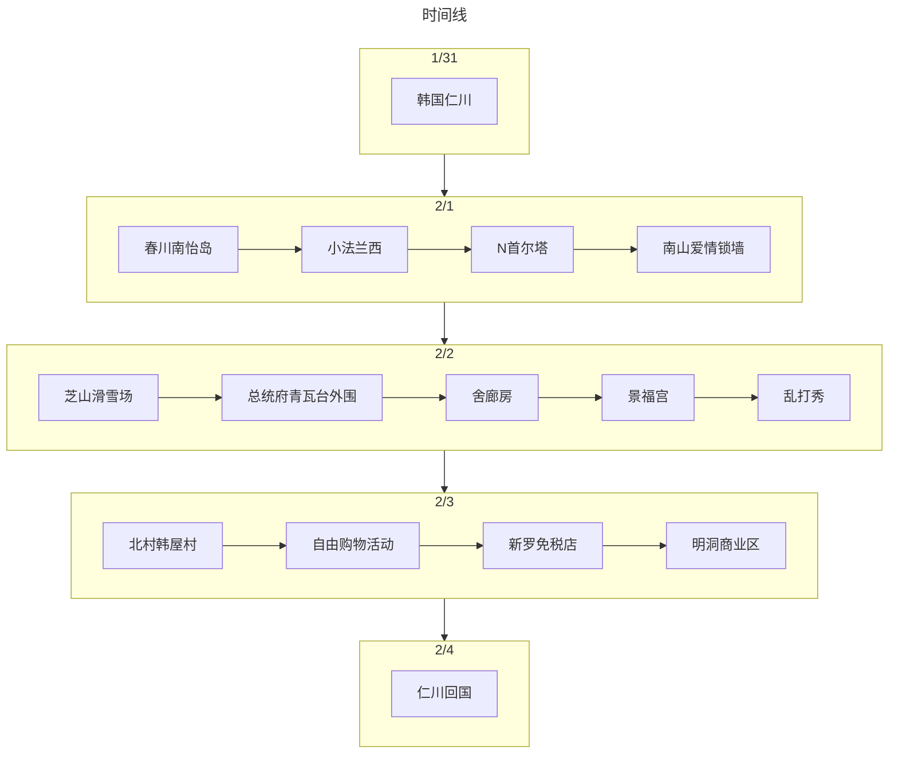

:::tip 总结

第2次和爸妈出国游，还记得当时是临近春节，从韩国回到深圳后，由于深圳没有飞机，只能打车到广州白云机场飞海口，回海口后还感冒了
由于是报团游，所以费用无法拆分，放到了“消费”当中
:::

## 旅游花费组成

总共消费是15417.00，包括了3 个人在韩国首尔+江原道+京畿道+仁川 5 天旅游所有费用。
> 1027.8元（每人/每天）

::: echarts

```js
option = {
  tooltip: {
    trigger: "item",
  },
  legend: {
    top: "5%",
    left: "center",
    selectedMode: true,
  },
  series: [
    {
      type: "pie",
      radius: ["40%", "70%"],
      center: ["50%", "70%"],
      startAngle: 180,
      label: {
        show: true,
        formatter(param) {
          return param.name + " (" + param.percent * 2 + "%)";
        },
      },
      data: [
        { value: 0, name: "交通" },
        { value: 15417, name: "消费" },
        { value: 0, name: "饮食" },
        { value: 0, name: "住宿" },

        {
          value: 15417.0,
          itemStyle: {
            color: "none",
            decal: {
              symbol: "none",
            },
          },
          label: {
            show: false,
          },
        },
      ],
    },
  ],
};
```

:::

## 交通

去程：国际航班 OZ 372
回程：国际航班 OZ 371

## 住宿

首尔 COEX 洲际酒店(韩国五花特一级酒店) 4晚

## 饮食

主要是团餐，比如烤肉

## 打卡景点列表

:::tabs
@tab:active 时间线



@tab 景点评价

太过久远，只找到[通知书](/assets/pdf/旅游/韩国出团通知书.pdf)的介绍