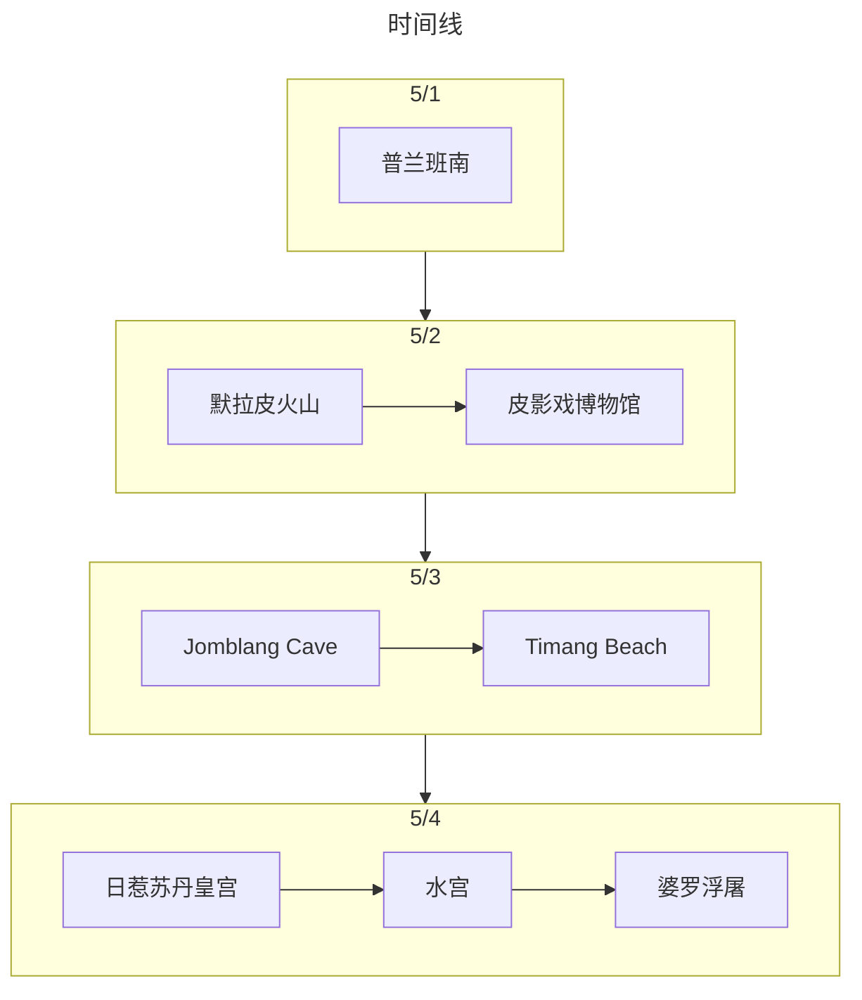

:::tip 总结

印尼日惹是冯先生和吴女士第一次出国+自由行，事前做了N多的攻略 ，是一次记忆非常深刻而且很有意义的旅行。
:::

## 旅游花费组成

总共消费是1.3W+，包括了2个人在印尼日惹4天旅游所有费用。

::: echarts

```js
option = {
  
 tooltip: {
   trigger: "item"
 },
 legend: {
   top: "5%",
   left: "center",
   // doesn"t perfectly work with our tricks, disable it
   selectedMode: true
 },
 series: [
   {
     type: "pie",
     radius: ["40%", "70%"],
     center: ["50%", "70%"],
     // adjust the start angle
     startAngle: 180,
     label: {
       show: true,
       formatter(param) {
         // correct the percentage
         return param.name + " (" + param.percent * 2 + "%)";
       }
     },
    data: [
       { value: 7426, name: "交通" },
       { value: 4048.48, name: "消费" },
       { value: 375.68, name: "饮食" },
       { value: 1378, name: "住宿" },
   
       {
         // make an record to fill the bottom 50%
         value: 7426 + 4048.48 + 375.68 +1378,
         itemStyle: {
           // stop the chart from rendering this piece
           color: "none",
           decal: {
             symbol: "none"
           }
         },
         label: {
           show: false
         }
       }
     ]
   }
 ]
};
```

:::

## 交通

飞机票是此次旅行的大头，约占了总费用的一半。我们去的时候是从深圳-雅加达-日惹，其中因为深圳-雅加达晚点了，因为机票是分开2个行程买的，坑爹携程不能退票或改签雅加达-日惹的行程，因此到了雅加达后，只能重新现场买票。然后到达当地主要是靠Grab网约车，线上叫车，线下付车费的方式。后面去天坑的时候花了200元找了Love Engine这家当地旅行社包了一辆车，他们家的无人机拍摄太出片了！

## 住宿

其实日惹的住宿算是性价比很高了，5.1-5.3 入住了凯悦日惹酒店，5.3-5.4 入住日惹菲尼克斯美憬阁酒店，酒店都非常有特色，而且环境很棒。还记得日惹菲尼克斯美憬阁酒店的小酒吧点了一杯mojito尝试了一下。


## 饮食

日惹的饮食还挺有特色的，不过为了照顾我们的“中国胃”，我们一般选择了西餐、海鲜餐等。不过因为大多数是用当地货币付款，少数是刷信用卡付款，因此饮食大部分列入到了“消费”类别。
PS：印象中记得Roaster and Bear这家西餐厅味道还不错，Jejamuran这家蘑菇做得很有特色。


## 打卡景点列表

:::tabs
@tab:active 时间线



@tab 景点评价

### 日惹（5/1-5/4）

#### 5/1：

普兰班南（★★★⚝⚝）：很有独特韵味的寺庙，很出片。不过针对外国人的门票比较贵


#### 5/2：

默拉皮火山（★★★★⚝）：在半山腰找了一家Jeep车公司(Merapi Jeep Land Cruiser)租车，去参观了遇难者纪念馆。挺有意义的。后面因为我们下山的时候叫不到车，还是司机小哥帮我们约了车。


皮影戏博物馆（★★★★⚝）：晚上去的，很有老手艺人的感觉，可惜皮影戏的剧情看得不是太懂。看完后还在路边买了2个椰子喝，顺带用Google translate和当地的老奶奶有一句没一句地聊天。


#### 5/3：

Jomblang Cave（★★★★★）：第一次进入洞穴探险，真的很神奇。是通过人力来进行升降进出洞穴，下降后通过泥泞的小路后可以看到里面有类似溶洞的地方，还可以看到“神圣”的光撒进洞穴内部。


Timang Beach（★★★★★）：离日惹有几个小时的车程，是一个独立在海岸边的小礁石，通过吊车、索桥进出。看海景真的非常棒！但是对于有点恐高的我是一个挑战。一到这里就有很上道的小哥过来说帮忙拍照，后面给他一点小费。然后玩完后，去吃了一顿龙虾大餐。


#### 5/4：
日惹苏丹皇宫（★★⚝⚝⚝）：印象不深的地方

水宫（★★★⚝⚝）：有很多小巷子，适合拍照

婆罗浮屠（★★★★⚝）：和普兰班南类似的寺庙群，不过地方挺大的

