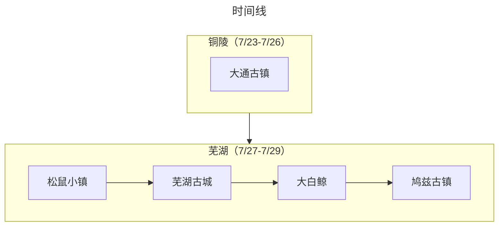

:::tip 总结

本次出行是采用飞机+当地租车的方式，“回娘家试出行”玩了铜陵+芜湖两地。由于是第一次带娃出远门，因此行程安排得非常松弛。
:::

## 旅游花费组成

总共消费是1W+，包括了2大1小在8天旅游所有费用。

::: echarts

```js
option = {
  
 tooltip: {
   trigger: "item"
 },
 legend: {
   top: "5%",
   left: "center",
   // doesn"t perfectly work with our tricks, disable it
   selectedMode: true
 },
 series: [
   {
     type: "pie",
     radius: ["40%", "70%"],
     center: ["50%", "70%"],
     // adjust the start angle
     startAngle: 180,
     label: {
       show: true,
       formatter(param) {
         // correct the percentage
         return param.name + " (" + param.percent * 2 + "%)";
       }
     },
    data: [
       { value: 7514.46, name: "交通" },
       { value: 895.67, name: "消费" },
       { value: 217, name: "饮食" },
       { value: 1657.85, name: "住宿" },
   
       {
         // make an record to fill the bottom 50%
         value: 7514.46 + 895.67 + 217 +1657.85,
         itemStyle: {
           // stop the chart from rendering this piece
           color: "none",
           decal: {
             symbol: "none"
           }
         },
         label: {
           show: false
         }
       }
     ]
   }
 ]
};
```

:::

## 交通

旅游首站是铜陵，直接从深圳坐飞机过去，然后九华山机场有神州租车的点。之前是已经在神州租车下了8天的订单，所以很快就提车了。后面的所有景点都是通过自驾的方式游玩。大交通+自驾租车+油费大概是7500+

## 住宿

其实住宿的自费费用只包含了在芜湖的2个晚上，分别在华邑酒店、新华联丽景酒店住了一晚，都是酒店+自助+景点门票的形式，但都算入了“住宿”类别。

## 饮食

感觉芜湖的消费还好，路边小馆子吃得不少，花费不是很多

## 打卡景点列表

:::tabs
@tab:active 时间线



@tab 景点评价

### 铜陵（7/23-7/26）

#### 7/25：


大通古镇（★★★⚝⚝）：全国独有的江豚保护区，可以体验“轮渡”，中午饭是在大通古镇上面吃的，遇到了一个同是来自由行的一家人，好客的大哥还邀请我们同桌吃饭，因此是“免费的午餐”。


### 芜湖（7/27-7/29）

#### 7/27：

松鼠小镇（★★★★⚝）：一个小动物园+游乐场+闲逛的地方，笑笑在这里第一次坐摩天轮。


#### 7/28：

芜湖古城（★★★⚝⚝）：一个比较新的商业化古城，笑笑喜欢吃耿福星的鸡丝面。


#### 7/29：

芜湖新华联大白鲸海洋公园（★★★★⚝）：一个一开始以为普普通通，实际上内部很大，很多地方可以参观的地方。以大白鲸为主题，也可以看到很多水生动植物。


鸠兹古镇（★★★⚝⚝）：就在大白鲸海洋公园边上的古镇，地方非常大，当时还租了一辆小电动观光车，现在看来是明智之举。可能是因为中午去的原因，天气比较热，地方也显得有点空旷，没啥项目可以互动。


