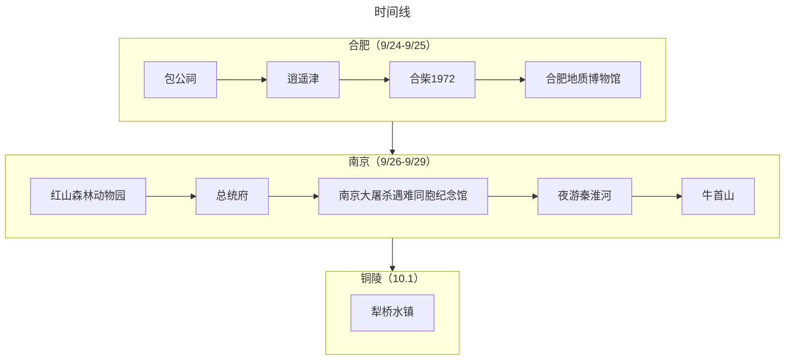

:::tip 总结

本次出行是采用飞机+当地租车的方式，“半个错峰出行”玩了合肥-南京-铜陵三地。总体而言由于带娃出行，因此行程安排得很松弛，最后顺带回铜陵娘家也玩了一个小景点（犁桥水镇）。
:::

## 旅游花费组成

总共消费是1.6W+，包括了3大1小在9天旅游所有费用。

::: echarts

```js
option = {
  
 tooltip: {
   trigger: "item"
 },
 legend: {
   top: "5%",
   left: "center",
   // doesn"t perfectly work with our tricks, disable it
   selectedMode: true
 },
 series: [
   {
     type: "pie",
     radius: ["40%", "70%"],
     center: ["50%", "70%"],
     // adjust the start angle
     startAngle: 180,
     label: {
       show: true,
       formatter(param) {
         // correct the percentage
         return param.name + " (" + param.percent * 2 + "%)";
       }
     },
    data: [
       { value: 8466.47, name: "交通" },
       { value: 1882.48, name: "消费" },
       { value: 3243.83, name: "饮食" },
       { value: 2714.4, name: "住宿" },
   
       {
         // make an record to fill the bottom 50%
         value: 8466.47 + 1882.48 + 3243.83 +2714.4,
         itemStyle: {
           // stop the chart from rendering this piece
           color: "none",
           decal: {
             symbol: "none"
           }
         },
         label: {
           show: false
         }
       }
     ]
   }
 ]
};
```
:::

## 交通
旅游首站是合肥，直接从深圳坐飞机过去，然后合肥机场有神州租车的点。之前是已经在神州租车下了9天的订单，所以很快就提车了。后面的所有景点都是通过自驾的方式游玩。大交通+自驾租车+油费大概是8400+

## 住宿
其实住宿的自费费用只包含了在南京的4个晚上，是租了一个2房2厅2卫的民俗，算下来要680元/晚，算比较贵的了，不过总体来说也算挺满意的，只是因为民俗是在夫子庙那一块，停车不太方便，基本都是靠路边停车，还被南京的交警开了1次罚单，幸好是首违免罚。

## 饮食
感觉合肥的消费还好，南京的网红打卡的餐厅价格都偏贵，南京的3-4人餐是在250-500一顿之间，感觉南京大牌档的性价比会高一点。

## 打卡景点列表

:::tabs
@tab:active 时间线



@tab 景点评价

### 合肥（9/24-9/25）

#### 9/24：

早上赶了早班飞机到了合肥，去了包公祠和逍遥津。

包公祠（★★⚝⚝⚝）：普普通通吧，然后带着娃从包公祠走路2公里到逍遥津，期间路过了步行街非常多人，热闹得很，就是“负重”2公里实在太费爹妈了。

<VideoPlayer 
src="https://ak-v.tripcdn.com/videos/K70q27000001i6vmv835F.mp4" 
poster="https://ak-d.tripcdn.com/images/01053120005wr7vq7A738.jpg"
/>

逍遥津（★★★⚝⚝）：给我感觉是一个公园+游乐场的地方，有很多小朋友的娱乐项目，笑笑在这里玩了旋转木马。

<VideoPlayer 
src="https://ak-v.tripcdn.com/videos/K70427000001i4kkp3DA9/mp4" 
poster="https://ak-d.tripcdn.com/images/0100i1200089iyocwDA2A.jpg"
/>

#### 9/25：

合柴1972（★★★★⚝）：由旧监狱改造的文创园，园区很大，适合大小朋友玩。里面的蒸汽小火车、家电博物馆、District Coffee都很不错。拍照也很能出片。最关键是还有猫咖，笑笑看了贼兴奋。个人感觉消费水平是中高


#### 9/26：

合肥地质博物馆（★★★⚝⚝）：一个“批了地质博物馆外皮的恐龙博物馆”，其中有好几层是恐龙的介绍，小朋友也挺喜欢的。


### 南京（9/26-9/29）

#### 9/27：

南京市红山森林动物园（★★★★★）：一个动物种群丰富、以“动物为本”的亲子乐园。很喜欢动物园里随处可见的“请勿投喂动物”、拒绝动物表演的标识，比起其他动物园的“有偿”投喂动物好多了。而且这里有很多很好看的盖章！（开启了南京盖章之旅）


#### 9/28：

总统府（★★★⚝⚝）：个人感觉是一个大公园，里面有可爱的“府猫”，任人随意撸，这一点很爽。

<VideoPlayer 
src="https://ak-v.tripcdn.com/videos/K70j26000001i4vte8608.mp4?ts=1658130220376" 
poster="https://ak-d.tripcdn.com/images/1A0b15000000y90y97885.jpg"
/>

侵华日军南京大屠杀遇难同胞纪念馆（★★★★★）：没有一个中国人能平静地离开这个地方。实在是太残酷了，每个中国人都应该去这里看看，勿忘国耻！


夜游秦淮河（★★★★⚝）：秦淮河夜景挺漂亮的，终于来到了“商女不知亡国恨，隔江犹唱后庭花”中的秦淮河，游船价格稍贵，是100元/人。


#### 9/29

牛首山（★★★⚝⚝）：一个以佛教为主题的风景区。5层地宫+睡佛很宏伟震撼，素面也很好吃。推荐信佛人士。


### 铜陵（10.1）

犁桥水镇（★★★★⚝）：一个新建的风景小镇。虽然饮食也和其他商业化古镇差不多，但是里面的服务人员态度很好，里面的一家咖啡馆也、小邮局也都还不错。但是因为是铜陵最近的“爆款”景点，导致来的人太多了，停车也很难停。出入口位置也小，导致进出水镇的人都挤一块去了。如果是淡季来，估计可以闲逛闲逛，感觉会舒服一点。

