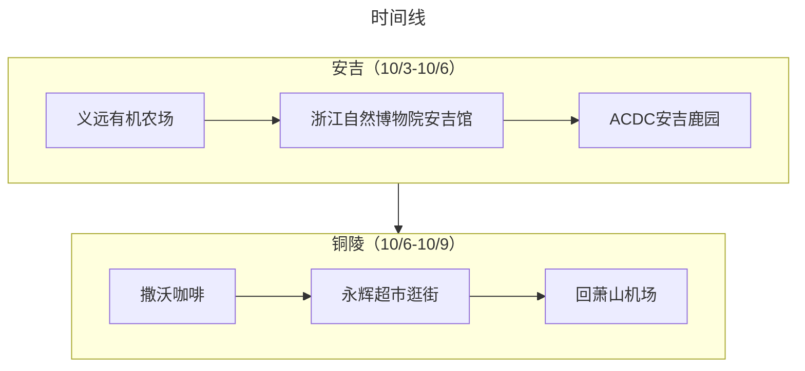

:::tip 总结

本次出行是采用飞机+当地租车的方式，“半个错峰出行”玩了安吉+铜陵两地。行程安排得很松弛，不过整体旅游感觉还是比较满意。
:::

## 旅游花费组成

总共消费是14122.71，包括了 2 大 1 小在安吉+铜陵 7 天旅游所有费用。
> 672.51元（每人/每天）

::: echarts

```js
option = {
  tooltip: {
    trigger: "item",
  },
  legend: {
    top: "5%",
    left: "center",
    selectedMode: true,
  },
  series: [
    {
      type: "pie",
      radius: ["40%", "70%"],
      center: ["50%", "70%"],
      startAngle: 180,
      label: {
        show: true,
        formatter(param) {
          return param.name + " (" + param.percent * 2 + "%)";
        },
      },
      data: [
        { value: 5915.4, name: "交通" },
        { value: 3201.43, name: "消费" },
        { value: 3005.88, name: "饮食" },
        { value: 2000, name: "住宿" },

        {
          value: 14122.71,
          itemStyle: {
            color: "none",
            decal: {
              symbol: "none",
            },
          },
          label: {
            show: false,
          },
        },
      ],
    },
  ],
};
```

:::

## 交通

旅游首站是杭州，直接从深圳坐飞机抵达萧山机场。之前是已经在神州租车下了 6 天的订单，所以很快就在交通中心提车了。后面的所有景点都是通过自驾的方式游玩，在10.9直接从铜陵开车回萧山机场，耗时约345公里（5个小时）

## 住宿

其实住宿的自费费用只包含了在安吉的 3 个晚上，花了2000租了一个美式风格的民宿，算下来要 666 元/晚，算比较贵的了，不过总体来说也算挺满意的，房间有一个大浴缸，方便笑笑洗澡，然后楼下还养了几只大猫咪，笑笑很喜欢和它们一起玩

## 饮食

感觉杭州、安吉的饮食很适合我这个“广东胃”，整体咸淡适中，味道也挺不错的。但是咖啡水准一般，且网红打卡的餐厅价格都偏贵，安吉的 2-4 人餐是在 300-400 一顿之间。

## 打卡景点列表

:::tabs
@tab:active 时间线



@tab 景点评价

### 安吉（10/3-10/6）
#### 10/4：
义远有机农场（★★★★⚝）：一个低龄宝宝很喜欢的牧场。有山羊、奶牛、小鸭子、小猪等常见的农场动物可以投喂和拍照，地方很大，适合休闲放空。


#### 10/5：
浙江自然博物院安吉馆（★★★★⚝）：果然是超级大的博物馆，有很多个分馆，每个分馆对应不同的主题。但是实在太大了，导致笑笑走到后面都走不动路。


#### 10/6：
ACDC 安吉鹿园（★★★⚝⚝）：有很多可爱的小鹿可以投喂，地方不大，适合闲逛拍照，门票和附近的咖啡馆消费相对较高，鹿园里面的消费倒是相对正常。
