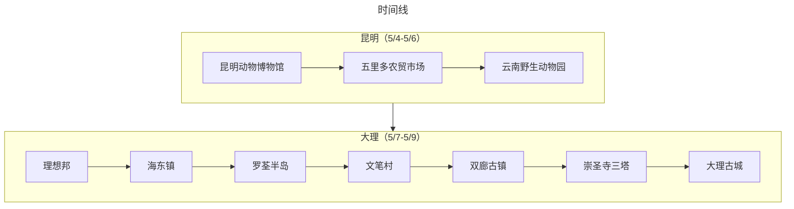

:::tip 总结

本次出行是采用飞机+当地租车的方式，“半个错峰出行”玩了昆明+大理两地。行程安排得很松弛，感觉在昆明玩得不是很尽兴，在大理环洱海自驾感觉还不错
:::

## 旅游花费组成

总共消费是9459.80，包括了 2 大 1 小在昆明+大理 6 天旅游所有费用。
> 525.54元（每人/每天）

::: echarts

```js
option = {
  tooltip: {
    trigger: "item",
  },
  legend: {
    top: "5%",
    left: "center",
    selectedMode: true,
  },
  series: [
    {
      type: "pie",
      radius: ["40%", "70%"],
      center: ["50%", "70%"],
      startAngle: 180,
      label: {
        show: true,
        formatter(param) {
          return param.name + " (" + param.percent * 2 + "%)";
        },
      },
      data: [
        { value: 4333.39, name: "交通" },
        { value: 1485.37, name: "消费" },
        { value: 1449.1, name: "饮食" },
        { value: 2191.94, name: "住宿" },

        {
          value: 9459.8,
          itemStyle: {
            color: "none",
            decal: {
              symbol: "none",
            },
          },
          label: {
            show: false,
          },
        },
      ],
    },
  ],
};
```

:::

## 交通

旅游首站是昆明，去程比较曲折，因为下雨飞机晚点3个小时才到昆明。然后5.7在大理租了2天的车，大交通+自驾租车+油费大概是 4300+

## 住宿

旅游总共住了5个晚上，全部在不同的酒店入住，收拾行李果然很麻烦。
5.4-5.5 昆明君乐酒店（★★⚝⚝⚝）：房间老旧，服务态度很好，整体不是很满意
5.5-5.6 云南维居金鹰大酒店（★★★★⚝）：有儿童专用的浴盆、洗浴用具，很不错
5.6-5.7 桔子水晶：（★★★⚝⚝）：有2.4的大床，整体不错
5.7-5.8 双廊民宿（★★⚝⚝⚝）：在上山，附近在修房子，整体不太满意
5.8-5.9 大理洱海龙湾假日酒店（★★★★⚝）：性价比很高的loft，整体满意，但是楼上2个房间没有空调

## 饮食

感觉2个城市的消费还好，随便一家米线兜不踩雷。
水果非常实惠（尤其是蓝莓）
菌菇火锅个人感觉一般，性价比不太高（可以类比深圳海鲜街大排档，昂贵的菌菇犹如昂贵的海鲜）
其他在古城的饮食也不算特别贵

## 打卡景点列表

:::tabs
@tab:active 时间线



@tab 景点评价

### 昆明（5/4-5/9）

#### 5/4：

飞机晚点了，到了酒店附近的翠湖公园逛了一会儿会儿，顺便找了街边的米线馆吃米线


#### 5/5：

昆明动物博物馆（★★★⚝⚝）：门票30元/人，内部都是动物标本，的确挺逼真的，但是地方不大，大概逛了2个小时久下来了


#### 5/6：

云南野生动物园（★★★⚝⚝）：一个“观赏距离很近”的动物园，可以近距离看到各种动物，尤其是被一大群孔雀包围的感觉很神奇。整个动物园还挺大的，做观光车都要10公里


### 大理（5/7-5/9）

#### 5/7：

洱海（★★★★⚝）：绕了洱海自驾了一周，风景真的好看，随处看到开敞篷车、骑自行车、电动车、徒步的人，即使不是五一的高峰期也非常有人气。

<VidStack 
src="https://ak-v.tripcdn.com/videos/R30ucn14x8ttpws1707A5.mp4" 
poster="https://ak-d.tripcdn.com/images/100p0h0000008s7xqA6E5_C_1200_800_Q70.jpg"
/>

文笔村（★★★★⚝）：开车路过的一个地方，路面经常看到彩虹般的颜色，挺适合休闲的，尽头还有人在卖咖啡


双廊古镇（★★★⚝⚝）：一个比较常见和普通的古镇

<VidStack 
src="https://ak-v.tripcdn.com/videos/R30gcn1a0dh3k7bww5D19.mp4" 
poster="https://ak-d.tripcdn.com/images/01069120008fjx3hp1920_C_1200_800_Q70.jpg"
/>

崇圣寺三塔（★★⚝⚝⚝）：订酒店时送的门票，感觉一般般
