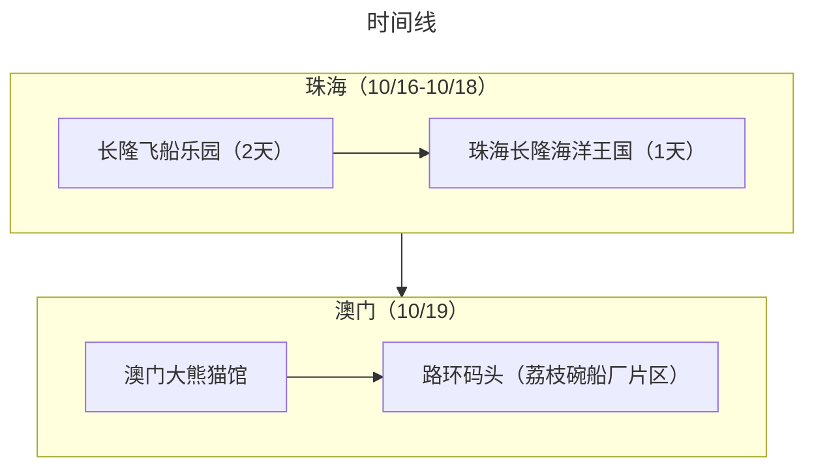

:::tip 总结

本次出行是自驾的方式，“错峰出行”玩了珠海+澳门两地。行程安排得很松弛，飞船酒店的住宿额外满意，澳门也挖掘了除了“娱乐场”以外的亲子玩法。
:::

## 旅游花费组成

总共消费是7228.32，包括了 3 大 1 小在珠海+澳门 4 天旅游所有费用。
> 451.77元（每人/每天）

::: echarts

```js
option = {
  tooltip: {
    trigger: "item",
  },
  legend: {
    top: "5%",
    left: "center",
    selectedMode: true,
  },
  series: [
    {
      type: "pie",
      radius: ["40%", "70%"],
      center: ["50%", "70%"],
      startAngle: 180,
      label: {
        show: true,
        formatter(param) {
          return param.name + " (" + param.percent * 2 + "%)";
        },
      },
      data: [
        { value: 564.38, name: "交通" },
        { value: 2160.55, name: "消费" },
        { value: 2378.59, name: "饮食" },
        { value: 2124.8, name: "住宿" },

        {
          value: 7228.320000000001,
          itemStyle: {
            color: "none",
            decal: {
              symbol: "none",
            },
          },
          label: {
            show: false,
          },
        },
      ],
    },
  ],
};
```

:::

## 交通

第一天直接从家自驾到飞船酒店，在最后一天去澳门全程是轻轨+公交，整体交通费用不多

## 住宿

旅游总共住了3个晚上。
10.16-10.17 长隆飞船酒店（★★★★★）：飞船房免费升级到了亲子星辰房，感觉特别划算，房间有滑滑梯和一个“小船”房间，笑笑很喜欢

10.18 Dreamer雲享公寓（★★⚝⚝⚝）：近横琴口岸的一个公寓，房间内不是很新，望远镜也坏了，外面的卫生也不太行，走廊有烟味，除了近没有啥优点。

## 饮食

- 第一顿打卡了`颓记`（★★★⚝⚝），感觉也就那样吧
- 在飞船酒店吃了2次自助（★★★★★）（午餐+晚餐），很满意海鲜的质量（尤其是蒸生蚝）
- 圆满海南鸡饭（★★★⚝⚝），一家人只有我比较合口味
- 澳门陆环码头面馆（★★★★★），点了捞面、汤面、盖饭，都很不错！不禁感慨一分钱一分货啊
- 澳门安德鲁饼店（★★★★★），蛋挞在热的时候很好吃！旁边的安德鲁咖啡馆也打卡了甜点，也很不错，很细腻的口感

## 打卡景点列表

:::tabs
@tab:active 时间线



@tab 景点评价

### 珠海（10/16-10/18）
#### 10/16-10/17：
长隆飞船乐园（★★★★⚝）：玩了2天。几乎全室内，很适合怕晒怕热的小朋友和爸妈。有飞船多的机动游戏可以畅玩，还有虎鲸表演。但是对孕妇不是很友好，没啥可以陪同的项目


#### 10/18：
珠海长隆海洋王国（★★⚝⚝⚝）：玩了半天，由于是室外，中午去感觉很热，而且算是比较老的项目了，很多设备都在维修。


### 澳门（10/19）
澳门大熊猫馆（★★★★★）：可以看到大熊猫，熊猫馆还有一个文创商店，可以DIY熊猫玩偶。路环码头附近也有很多网红店值得打卡

荔枝碗船厂片区（★★★★★）：在路环码头步行可以到达，有很多小朋友玩的户外设施，也有一个很大的攀爬架，但是笑笑没到年龄不能玩
