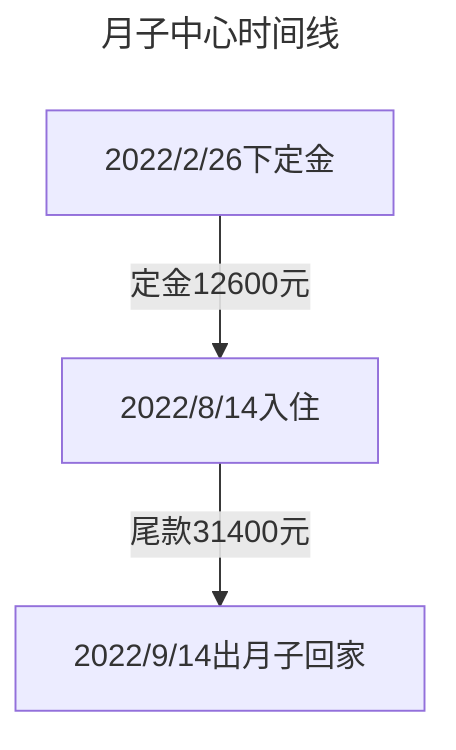

---
# 这是文章的标题
title: 笑笑周岁回忆录
# 这是页面的图标
icon: book
# 设置写作时间
date: 2023-08-23
# 一个页面可以有多个分类
category:
  - 家庭
# 一个页面可以有多个标签
tag:
  - 家庭
# 此页面会在文章列表置顶
#sticky: true
# 此页面会出现在文章收藏中
star: true
# 你可以自定义页脚
#footer: 这是测试显示的页脚
# 你可以自定义版权信息
#copyright: 无版权
---
:::tabs

@tab 出生那一天
笑笑出生的前一个周日（2022/8/7），我们一家人还去了平安大厦的高层吃了自助餐。随着预产期的临近，一家人的心情也略有些紧张，于是在8.9办理了住院。8.10早上7点多的时候，吴女士就破水了，让我俩感觉又意外又庆幸。在白天等待的时候，还给吴女士点了盒饭和悄悄送进了手机，但是后面据说因为躺着加上没有胃口，就也没吃得下多少东西。

> 八月九号晚上8点半拍的，距离笑笑出生差不多24小时

在焦急等待到晚上后，我看着不断有宝宝从产房推出来，但迟迟没有见我们家崽崽的时候，心情就愈发焦急，虽然嘴上不断地说要冷静，但是内心的忧虑实在掩盖不住。

后来等到7点多的时候，还是只开了二指，医生基于担心宝宝缺氧，则建议我们尽早剖腹产。在签署手术同意书后差不多再过了1个小时，娃终于出来了！全身白白的，还紧闭着眼睛。

后来护士推着娃去打了疫苗，再过了半个小时吴女士才被推了出来，估计是因为麻药还没过的原因，她在病床上迷迷糊糊的。

等到了凌晨，给笑笑喂了几次奶，然后才匆匆睡去。第二天中午才稍微有点时间，还发了个[朋友圈视频](https://pan.4a1801.life/Onedrive-4A1801/%E4%B8%AA%E4%BA%BA%E5%BB%BA%E7%AB%99/assets/article/%E5%AE%B6%E5%BA%AD/%E7%AC%91%E7%AC%91%E6%88%90%E9%95%BF/20220810%E7%AC%91%E7%AC%91%E5%87%BA%E7%94%9F%E6%9C%8B%E5%8F%8B%E5%9C%88.mp4)

@tab 月子中心

吴女士的月子中心特地找了一家离家很近的地方，离家3公里左右，还是那种面朝大海的“大别野”。环境还挺好的，月子餐也不错，我们在这里度过了初为人父人母的第一个月，一切都是挑战，在这里也学会了怎么给娃换尿布、洗澡。期间还发生了不愉快的事情[^1]。

> 月子中心外景

> 其实这里的阿姨也不算太专业，尤其是单手抱娃洗澡的教法，让娃在后面一次体检中发现腿纹不对称。

@tab 成长时间线
说来惭愧，带娃的主力主要是吴女士和笑笑外婆两位大将，笑爸偶尔出出力气。在吴女士休产假结束了以后，笑爸因为具有得天独厚的优势——公司离家走路10分钟的优势，偶尔中午还可以回家看看娃，不过也以打酱油为主就是了。

# 1-3月

* 衣:50cm
* 食:母乳
* 住:月子中心
* 行:较少外出
* 动作：慢慢地学会了抬头
* 其他：大部分时间都在睡眠中度过，喜欢呆呆地看向窗外，默不作声。

> 1月龄 2022/09/09
> 封面：2022/09/09，视频：2022/09/25
> 2022/09/23 开始坐安全座椅外出了
<VideoPlayer 
src="https://pan.4a1801.life/d/Onedrive-4A1801/%E4%B8%AA%E4%BA%BA%E5%BB%BA%E7%AB%99/public/article/%E5%AE%B6%E5%BA%AD/%E7%AC%91%E7%AC%91%E6%88%90%E9%95%BF/20220925%E7%AC%91%E7%AC%91.mp4"
poster="https://pan.4a1801.life/d/Onedrive-4A1801/%E4%B8%AA%E4%BA%BA%E5%BB%BA%E7%AB%99/public/article/%E5%AE%B6%E5%BA%AD/%E7%AC%91%E7%AC%91%E6%88%90%E9%95%BF/20220909%E7%AC%91%E7%AC%91-1%E6%9C%88%E9%BE%84.webp" />

> 2月龄 2022/10/10笑笑
> 封面：2022/10/10，视频：2022/10/04

<VideoPlayer 
src="https://pan.4a1801.life/d/Onedrive-4A1801/%E4%B8%AA%E4%BA%BA%E5%BB%BA%E7%AB%99/public/article/%E5%AE%B6%E5%BA%AD/%E7%AC%91%E7%AC%91%E6%88%90%E9%95%BF/20221004%E7%AC%91%E7%AC%91-2%E6%9C%88%E9%BE%84.mp4"
poster="https://pan.4a1801.life/d/Onedrive-4A1801/%E4%B8%AA%E4%BA%BA%E5%BB%BA%E7%AB%99/public/article/%E5%AE%B6%E5%BA%AD/%E7%AC%91%E7%AC%91%E6%88%90%E9%95%BF/20221010%E7%AC%91%E7%AC%91-2%E6%9C%88%E9%BE%84.webp" />

> 3月龄 2022/11/10
<VideoPlayer 
src="https://pan.4a1801.life/d/Onedrive-4A1801/%E4%B8%AA%E4%BA%BA%E5%BB%BA%E7%AB%99/public/article/%E5%AE%B6%E5%BA%AD/%E7%AC%91%E7%AC%91%E6%88%90%E9%95%BF/20221110%E7%AC%91%E7%AC%91-3%E6%9C%88%E9%BE%84.mp4"
poster="https://pan.4a1801.life/d/Onedrive-4A1801/%E4%B8%AA%E4%BA%BA%E5%BB%BA%E7%AB%99/public/article/%E5%AE%B6%E5%BA%AD/%E7%AC%91%E7%AC%91%E6%88%90%E9%95%BF/20221110%E7%AC%91%E7%AC%91-3%E6%9C%88%E9%BE%84.webp" />

# 4月-6月

* 衣: 60-80cm
* 食:母乳为主、加入高铁米粉，开始自己坐餐椅上了
* 住:瓦德拉婴儿床
* 行:BEBEBUS婴儿车
* 动作：慢慢学会翻身了
* 其他：肠胃不适，拉了差不多一个月的肚子。

> 4月龄 2022/12/10
> 封面：2022/12/10，视频：2022/12/21

<VideoPlayer 
src="https://pan.4a1801.life/d/Onedrive-4A1801/%E4%B8%AA%E4%BA%BA%E5%BB%BA%E7%AB%99/public/article/%E5%AE%B6%E5%BA%AD/%E7%AC%91%E7%AC%91%E6%88%90%E9%95%BF/20221221%E7%AC%91%E7%AC%91-4%E6%9C%88%E9%BE%84.mp4"
poster="https://pan.4a1801.life/d/Onedrive-4A1801/%E4%B8%AA%E4%BA%BA%E5%BB%BA%E7%AB%99/public/article/%E5%AE%B6%E5%BA%AD/%E7%AC%91%E7%AC%91%E6%88%90%E9%95%BF/20221210%E7%AC%91%E7%AC%91-4%E6%9C%88%E9%BE%84.webp" />

> 5月龄 2023/01/10
> 封面：2023/01/10，视频：2023/01/24
> 2023/01/20 开始坐背带外出了
<VideoPlayer 
src="https://pan.4a1801.life/d/Onedrive-4A1801/%E4%B8%AA%E4%BA%BA%E5%BB%BA%E7%AB%99/public/article/%E5%AE%B6%E5%BA%AD/%E7%AC%91%E7%AC%91%E6%88%90%E9%95%BF/20230124%E7%AC%91%E7%AC%91-5%E6%9C%88%E9%BE%84.mp4"
poster="https://pan.4a1801.life/d/Onedrive-4A1801/%E4%B8%AA%E4%BA%BA%E5%BB%BA%E7%AB%99/public/article/%E5%AE%B6%E5%BA%AD/%E7%AC%91%E7%AC%91%E6%88%90%E9%95%BF/20230110%E7%AC%91%E7%AC%91-5%E6%9C%88%E9%BE%84.webp" />

> 6月龄 2023/02/10
> 2023/02/01 开始坐餐椅吃饭了
<VideoPlayer 
src="https://pan.4a1801.life/d/Onedrive-4A1801/%E4%B8%AA%E4%BA%BA%E5%BB%BA%E7%AB%99/public/article/%E5%AE%B6%E5%BA%AD/%E7%AC%91%E7%AC%91%E6%88%90%E9%95%BF/20230210%E7%AC%91%E7%AC%91-6%E6%9C%88%E9%BE%84.mp4"
poster="https://pan.4a1801.life/d/Onedrive-4A1801/%E4%B8%AA%E4%BA%BA%E5%BB%BA%E7%AB%99/public/article/%E5%AE%B6%E5%BA%AD/%E7%AC%91%E7%AC%91%E6%88%90%E9%95%BF/20230210%E7%AC%91%E7%AC%91-6%E6%9C%88%E9%BE%84.webp" />

# 7月-9月

* 衣:90cm-100cm
* 食:母乳为主、辅食：需要打碎成泥、水果（咬咬乐）
* 住:跟大人一起睡
* 行:婴儿车
* 动作：慢慢学会翻身了
* 其他：对外面的时间也逐渐好奇且有反应，逐渐有了自己的“交际圈”。

> 7月龄 2023/03/10
<VideoPlayer 
src="https://pan.4a1801.life/d/Onedrive-4A1801/%E4%B8%AA%E4%BA%BA%E5%BB%BA%E7%AB%99/public/article/%E5%AE%B6%E5%BA%AD/%E7%AC%91%E7%AC%91%E6%88%90%E9%95%BF/20230310%E7%AC%91%E7%AC%91-7%E6%9C%88%E9%BE%84.mp4"
poster="https://pan.4a1801.life/d/Onedrive-4A1801/%E4%B8%AA%E4%BA%BA%E5%BB%BA%E7%AB%99/public/article/%E5%AE%B6%E5%BA%AD/%E7%AC%91%E7%AC%91%E6%88%90%E9%95%BF/20230310%E7%AC%91%E7%AC%91-7%E6%9C%88%E9%BE%84.webp" />

> 8月龄 2023/04/10
<VideoPlayer 
src="https://pan.4a1801.life/d/Onedrive-4A1801/%E4%B8%AA%E4%BA%BA%E5%BB%BA%E7%AB%99/public/article/%E5%AE%B6%E5%BA%AD/%E7%AC%91%E7%AC%91%E6%88%90%E9%95%BF/20230410%E7%AC%91%E7%AC%91-8%E6%9C%88%E9%BE%84.mp4"
poster="https://pan.4a1801.life/d/Onedrive-4A1801/%E4%B8%AA%E4%BA%BA%E5%BB%BA%E7%AB%99/public/article/%E5%AE%B6%E5%BA%AD/%E7%AC%91%E7%AC%91%E6%88%90%E9%95%BF/20230410%E7%AC%91%E7%AC%91-8%E6%9C%88%E9%BE%84.webp" />

# 9月-12月

* 衣:
* 食:母乳为主、辅食（不需要打成泥了）、水果（切小块）、白米饭
* 住:跟大人一起睡
* 行:婴儿车
* 动作：喜欢模仿大人的动作、声音，对周围的事物都很好奇，喜欢用手触碰。从躺着到坐着的转换已经非常熟练，逐渐学会了“飞吻”、“再见”、“亲一个”等简单的动作
* 其他：检查还是缺铁，目前在强制“灌药”中。

> 9月龄 2023/05/10
> 封面：2023/05/10，视频：2023/05/21
<VideoPlayer 
src="https://pan.4a1801.life/d/Onedrive-4A1801/%E4%B8%AA%E4%BA%BA%E5%BB%BA%E7%AB%99/public/article/%E5%AE%B6%E5%BA%AD/%E7%AC%91%E7%AC%91%E6%88%90%E9%95%BF/20230521%E7%AC%91%E7%AC%91-9%E6%9C%88%E9%BE%84.mp4"
poster="https://pan.4a1801.life/d/Onedrive-4A1801/%E4%B8%AA%E4%BA%BA%E5%BB%BA%E7%AB%99/public/article/%E5%AE%B6%E5%BA%AD/%E7%AC%91%E7%AC%91%E6%88%90%E9%95%BF/20230510%E7%AC%91%E7%AC%91-9%E6%9C%88%E9%BE%84.webp" />

> 10月龄 2023/06/10
> 封面：2023/06/10，视频：2023/06/06
<VideoPlayer 
src="https://pan.4a1801.life/d/Onedrive-4A1801/%E4%B8%AA%E4%BA%BA%E5%BB%BA%E7%AB%99/public/article/%E5%AE%B6%E5%BA%AD/%E7%AC%91%E7%AC%91%E6%88%90%E9%95%BF/20230606%E7%AC%91%E7%AC%91-10%E6%9C%88%E9%BE%84.mp4"
poster="https://pan.4a1801.life/d/Onedrive-4A1801/%E4%B8%AA%E4%BA%BA%E5%BB%BA%E7%AB%99/public/article/%E5%AE%B6%E5%BA%AD/%E7%AC%91%E7%AC%91%E6%88%90%E9%95%BF/20230610%E7%AC%91%E7%AC%91-10%E6%9C%88%E9%BE%84.webp" />

> 11月龄 2023/07/10
> 封面：2023/07/10，视频：2023/07/12
<VideoPlayer 
src="https://pan.4a1801.life/d/Onedrive-4A1801/%E4%B8%AA%E4%BA%BA%E5%BB%BA%E7%AB%99/public/article/%E5%AE%B6%E5%BA%AD/%E7%AC%91%E7%AC%91%E6%88%90%E9%95%BF/20230712%E7%AC%91%E7%AC%91-11%E6%9C%88%E9%BE%84.mp4"
poster="https://pan.4a1801.life/d/Onedrive-4A1801/%E4%B8%AA%E4%BA%BA%E5%BB%BA%E7%AB%99/public/article/%E5%AE%B6%E5%BA%AD/%E7%AC%91%E7%AC%91%E6%88%90%E9%95%BF/20230710%E7%AC%91%E7%AC%91-11%E6%9C%88%E9%BE%84.webp" />

> [1周岁啦！](/家庭/笑笑/笑笑一周岁) 2023/08/10

<VideoPlayer 
src="https://pan.4a1801.life/d/Onedrive-4A1801/%E4%B8%AA%E4%BA%BA%E5%BB%BA%E7%AB%99/public/article/%E5%AE%B6%E5%BA%AD/%E7%AC%91%E7%AC%91%E6%88%90%E9%95%BF/20230810%E7%AC%91%E7%AC%91%E6%8A%93%E5%91%A8.MOV"
poster="https://pan.4a1801.life/d/Onedrive-4A1801/%E4%B8%AA%E4%BA%BA%E5%BB%BA%E7%AB%99/public/article/%E5%AE%B6%E5%BA%AD/%E7%AC%91%E7%AC%91%E6%88%90%E9%95%BF/20230810%E7%AC%91%E7%AC%91%E6%8A%93%E5%91%A8.webp" />

[^1]: 坐月子期间遇到了突发其来的封小区，恰巧那会儿在金福大厦办理退租，导致哪都不能去，只能一个人在外面独自住了几个晚上。
    
@tab 笑笑的歌单

# 最开始听的音乐
<AudioPlayer
src="/assets/audio/笑笑婴儿床铃声.m4a"
title="笑笑婴儿床铃声"
width=100%
poster="/logo2.webp"
/>

# 笑笑的哄睡曲目
> ***3000***+播放的 【离人】
> ***2200***+播放的【这世界那么多人】
> ***1300***+播放的【晚安喵】

<iframe frameborder="no" border="0" marginwidth="0" marginheight="0" width=100% height=250 src="https://music.163.com/outchain/player?type=0&id=7686612545&auto=0"></iframe>

# 笑笑的日常曲目
> ***200***+播放的【卡路里】
<iframe frameborder="no" border="0" marginwidth="0" marginheight="0" width=100% height=450 src="https://music.163.com/outchain/player?type=0&id=8701979502&auto=0"></iframe>
