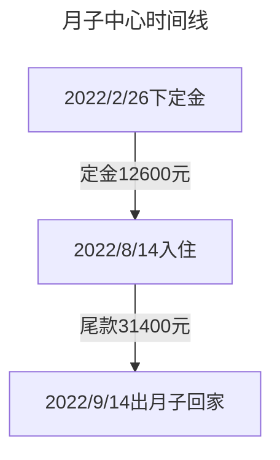

:::tabs

@tab 出生那一天
笑笑出生的前一个周日（2022/8/7），我们一家人还去了平安大厦的高层吃了自助餐。随着预产期的临近，一家人的心情也略有些紧张，于是在 8.9 办理了住院。8.10 早上 7 点多的时候，吴女士就破水了，让我俩感觉又意外又庆幸。在白天等待的时候，还给吴女士点了盒饭和悄悄送进了手机，但是后面据说因为躺着加上没有胃口，就也没吃得下多少东西。

> 八月九号晚上 8 点半拍的，距离笑笑出生差不多 24 小时

在焦急等待到晚上后，我看着不断有宝宝从产房推出来，但迟迟没有见我们家崽崽的时候，心情就愈发焦急，虽然嘴上不断地说要冷静，但是内心的忧虑实在掩盖不住。

后来等到 7 点多的时候，还是只开了二指，医生基于担心宝宝缺氧，则建议我们尽早剖腹产。在签署手术同意书后差不多再过了 1 个小时，娃终于出来了！全身白白的，还紧闭着眼睛。

后来护士推着娃去打了疫苗，再过了半个小时吴女士才被推了出来，估计是因为麻药还没过的原因，她在病床上迷迷糊糊的。

等到了凌晨，给笑笑喂了几次奶，然后才匆匆睡去。第二天中午才稍微有点时间，还发了个朋友圈视频

<VidStack
src="https://pan.4a1801.life:11443/d/public/article/%E5%AE%B6%E5%BA%AD/%E7%AC%91%E7%AC%91%E6%88%90%E9%95%BF/0-1%E5%B2%81/20220810%E7%AC%91%E7%AC%91%E5%87%BA%E7%94%9F%E6%9C%8B%E5%8F%8B%E5%9C%88.mp4"
poster="https://pan.4a1801.life:11443/d/public/article/%E5%AE%B6%E5%BA%AD/%E7%AC%91%E7%AC%91%E6%88%90%E9%95%BF/0-1%E5%B2%81/20220810%E7%AC%91%E7%AC%91%E5%87%BA%E7%94%9F%E6%9C%8B%E5%8F%8B%E5%9C%88.webp"
/>

@tab 月子中心

吴女士的月子中心特地找了一家离家很近的地方，离家 3 公里左右，还是那种面朝大海的“大别野”。环境还挺好的，月子餐也不错，我们在这里度过了初为人父人母的第一个月，一切都是挑战，在这里也学会了怎么给娃换尿布、洗澡。期间还发生了不愉快的事情[^1]。

> 月子中心外景

> 其实这里的阿姨也不算太专业，尤其是单手抱娃洗澡的教法，让娃在后面一次体检中发现腿纹不对称。

@tab 成长时间线
说来惭愧，带娃的主力主要是吴女士和笑笑外婆两位大将，笑爸偶尔出出力气。在吴女士休产假结束了以后，笑爸因为具有得天独厚的优势——公司离家走路 10 分钟的优势，偶尔中午还可以回家看看娃，不过也以打酱油为主就是了。

具体记录可见：[笑笑0-1周岁](/家庭/笑笑/历年成长记录/笑笑0-1周岁)

[^1]: 坐月子期间遇到了突发其来的封小区，恰巧那会儿在金福大厦办理退租，导致哪都不能去，只能一个人在外面独自住了几个晚上。

@tab 笑笑的歌单

# 最开始听的音乐

<AudioPlayer
src="/assets/audio/笑笑婴儿床铃声.m4a"
title="笑笑婴儿床铃声"
width=100%
poster="/logo2.jpg"
/>

# 笑笑的TOP10哄睡曲目（截止2024/9/26）
> **_5400_**+播放的【晚安喵】
> **_3300_**+播放的【这世界那么多人】
> **_3100_**+播放的 【离人】
> **_1300_**+播放的 【小兔子乖乖（贝乐虎）】
> **_1100_**+播放的 【世上只有妈妈好】
> **_560_**+播放的 【一笑江湖 (DJ弹鼓版)】
> **_540_**+播放的 【小兔子乖乖（宝宝巴士）】
> **_510_**+播放的 【听我说谢谢你】
> **_510_**+播放的 【卡路里】
> **_300_**+播放的 【不属于地球上的】

<iframe frameborder="no" border="0" marginwidth="0" marginheight="0" width=100% height=250 src="https://music.163.com/outchain/player?type=0&id=7686612545&auto=0"></iframe>

# 笑笑的日常曲目

> **_200_**+播放的【卡路里】

<iframe frameborder="no" border="0" marginwidth="0" marginheight="0" width=100% height=450 src="https://music.163.com/outchain/player?type=0&id=8701979502&auto=0"></iframe>
