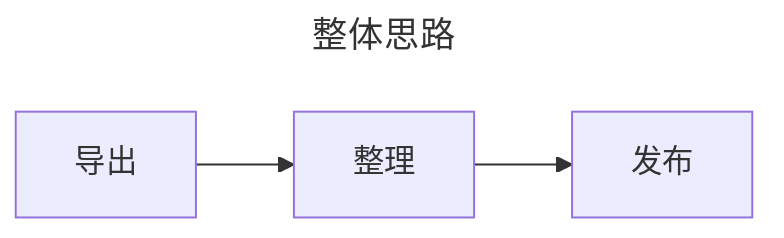

:::tip 前言
备份这些大社交媒体内容，也算是给我们的青春做一个备份吧，怕这些社交媒体哪天说停运就停运了，丝毫不给我们回忆的机会。
:::

## 1. 方法思路

总体来说，备份的思路是:

### 1.1 导出

其中对我而言最困难的就是“导出”这个步骤，对于微博、QQ空间、小红书而言，可以借助现有的项目，实现相对容易的导出，对于贴吧而言，找了很久都没有找到合适的项目，后来几番寻找，找到了 `八爪鱼采集器`这个软件，在这个软件的帮助下，实现了数据的导出。
:::note
理论上 `八爪鱼采集器`也可以备份微博、QQ空间，但是现有的工具比较成熟了，也比较“傻瓜化”，不需要再白费力气琢磨如何从头开始获取数据。
:::

### 1.2 整理

其实是对排版的整理，让初始的数据更好地在博客上面展示。而且，我想尽量原汁原味地保存下来，包括当时使用的表情符号、对应的链接跳转、图片等等，但是发现微博的很多表情符号都不再使用了，如 `[挖鼻屎]`这种。

### 1.3 发布

这个是相对简单的一部了，将已经处理好的内容，添加上[Frontmatter](https://theme-hope.vuejs.press/zh/config/frontmatter/info.html)后就可以发布了。

## 2. [个人QQ空间内容备份](/Arthur/Qzone/说说)

(1) 通过下面这个项目，将所有信息导出md格式、原始图片信息

> [ShunCai/QZoneExport: QQ空间导出助手](https://github.com/ShunCai/QZoneExport.html)

(2) 将图片信息上传到onedrive网盘，借助在云服务端部署的alist转换为直链
(3) 使用vscode，手工将导出的md文件内的图片相对路径，批量修改为直链对应的链接

## 3. [微博内容备份](/Arthur/Weibo)

(1) 通过下面这个项目，将所有信息导出md格式、原始图片信息

> [Uchiha-Peng/weibo2markdown: 微博导出、微博备份、微博导出生成Markdown、微博爬虫 (github.com)](https://github.com/Uchiha-Peng/weibo2markdown)

(2) ~~获取的图片直链是不能直接访问的，需要借助 `https://image.baidu.com/search/down?url=图片地址`，将图片转换成可被识别的地址（到此md文件的图片就可以预览了，也可以通过3-4步骤下载图片自行保存）~~
   2023/9/11: 在我的建议下，项目更新了下载图片的功能，目前已经可以通过该项目便捷下载所有图片到本地。
(3) 通过浏览器插件/稳部落，将图片下载到本地，然后上传到onedrive网盘，借助在云服务端部署的alist转换为直链
(4) 使用vscode，手工将导出的md文件内的图片相对路径，批量修改为直链对应的链接

## 4. [百度贴吧内容备份](/Arthur/Tieba/)

### 4.1 列表备份

(1) 下载八爪鱼采集器
   [免费下载-Windows大数据采集软件下载 - 八爪鱼采集器 (bazhuayu.com)](https://www.bazhuayu.com/download/windows)
(3)  输入以下网址，确定导出的字段，采集完后导出为html格式

   [我的贴子_i贴吧 (baidu.com)](https://tieba.baidu.com/i/i/my_tie)

   [我回复的_i贴吧 (baidu.com)](https://tieba.baidu.com/i/i/my_reply)
(3) 通过 [python代码](/经验总结/IT总结/实用工具汇总.html#html合并后转换为markdown)合并为一个html文件，并将该 `html `转换成 `markdown`格式
(4) 手动调整markdown的内容，使其在vuepress主题下能正常展示

### 4.2 各贴子内容备份

各个贴子内容备份的难度比我想象中的要大，在github找了很久，都没有找到“开箱即用”的成熟的项目。后来找到一个单链接下载的python脚本，然后再借助CHATGPT，微调了一下代码，使其能支持批量下载（前提是先通过“列表备份”这一步骤导出所有需要备份的贴吧链接）。
原项目：[yuzequn095/tieba_crawler_tool: Use Python3 to backup Baidu tieba content (github.com)](https://github.com/yuzequn095/tieba_crawler_tool/)

魔改后的项目：[arthurfsy2/tieba_crawler_tool: Use Python3 to backup Baidu tieba content (github.com)](https://github.com/arthurfsy2/tieba_crawler_tool)

## 5. [搜狗问问](/Arthur/搜狗问问/我的回答/list)

### 5.1 列表备份

[提问列表](/Arthur/搜狗问问/我的提问/list)
[回答列表](/Arthur/搜狗问问/我的回答/list)
打开个人页，复制网页的提问/回答列表，直接粘贴到 `typora`当中。（贴吧不能通过这个办法估计是因为贴吧的列表有防爬策略）

### 5.2 提问/回答详情页备份

在github找了一圈，果然也没找到现成的项目，再次通过强大的ChatGPT写了一个脚本。
[arthurfsy2/sougouwenwen_crawler_tool: 一个可以批量爬取指定搜狗问问问题链接，下载并转换为.md格式的python脚本。](https://github.com/arthurfsy2/sougouwenwen_crawler_tool)

## 6. [小红书内容备份](/Arthur/XHS/)
自从我的新的自行车VOOK ONE 拿到手后，就嘚瑟地在小红书发了第一篇内容，后面都是发骑行相关的分享。

(1) 通过下面这个项目，在NAS上部署server服务，用来下载小红书的图片、视频

> [JoeanAmier/XHS-Downloader: 小红书链接提取/作品采集工具：提取账号发布、收藏、点赞、专辑作品链接；提取搜索结果作品、用户链接；采集小红书作品信息；提取小红书作品下载地址；下载小红书无水印作品文件！](https://github.com/JoeanAmier/XHS-Downloader)

(2) 自己写了一个脚本，可以通过python脚本进行post请求获取到对应的作品数据，并转换为markdown文档

> 目前这个工具暂时还无法持续监测某个账号下已发布的作品列表，因此暂时无法实现自动更新和同步到blog的功能

> [Blog_script](https://github.com/arthurfsy2/Blog_script)