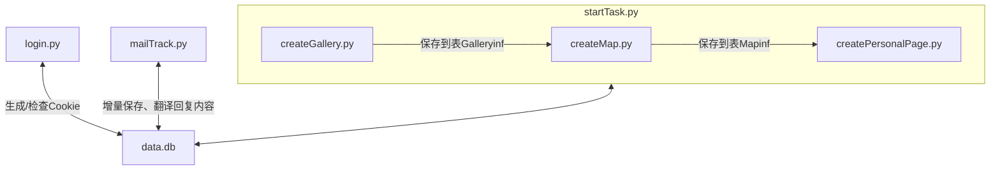
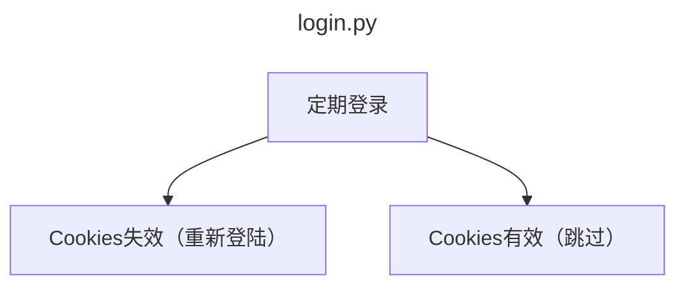
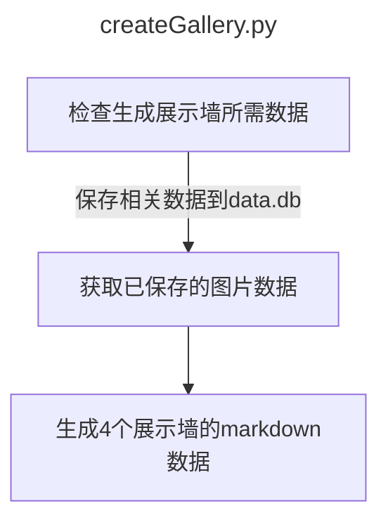
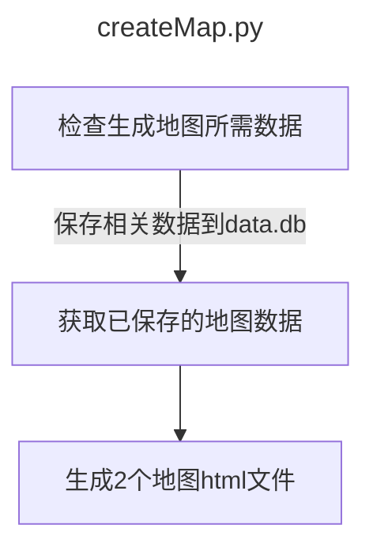
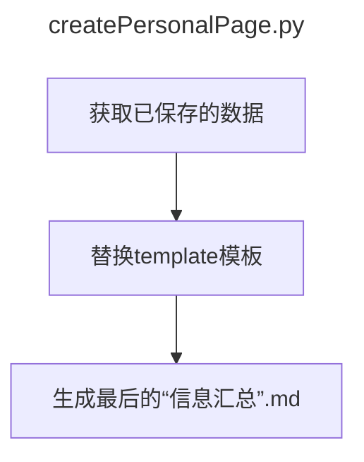
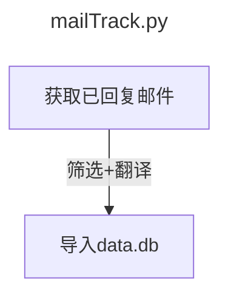

:::tip 前言
最近两个月又玩起了postcrossing，想着能否抓取网站数据，形成+整合自己的展示墙、地图、统计表、明信片故事，并在博客中显示。
:::
<Share colorful services="qq,weibo,qrcode"/>

## [成果展示（←点击查看）](https://blog.4a1801.life/Arthur/postcrossing/信息汇总.html)

:::info 特点总结

项目地址：https://github.com/arthurfsy2/Postcrossing_map_generator

1. 展示墙
		抓取官网的`/gallery`下的4个模块，下载gallery对应的图片，并生成包含fronttage的.md文件，以便你放入到**vuepress**当中使用

2. 地图
		参考官网的`/map`的样式，通过ClusterMap、Map这2个地图分别展示了聚合效果、散点展示效果，且每个地图都通过Geojson来标记收发国家的“足迹”。

3. **信息汇总**：

   汇总以下模块的内容

   - 图片墙：统计个人收发数据、对应4个展示墙的超链接
     

   - 地图展示：集成`map.html、clusterMap.html`这2个地图的内容

     

     

   - 统计

     ​		抓取官网的`/stats`下的3个模块，分别展示`收发记录（年、月）`、`国家分布（饼图）`、`各国明信片（表格）`、`还在漂泊的明信片（表格）`

     >  图形是通过echarts插件显示，表格是通过markdown的表格实现。）

     

     

   - 明信片故事：读取人工填写的`./temnplate/postcardStory`生成明信片故事的**词云**，并为每个已填写“故事”的明信片展示图片、内容

     
     
     
     
     

   

   - 被注册时收到的回复

     ​		当你寄出的邮件被登记后，可定时抓取你账号postcrossing账号关联邮箱的**回复邮件内容**（"Hurray! Your postcard CN-XXX to XXXX"的邮件）

     
     
   - 增量更新

     ​		抓取后的信息会保存到./template/data/db数据库当中，如果以后有更新，只会抓取更新部分并存入到数据库，减少对Postcrossing的压力。

:::

## 方法思路

总体而言，通过postcrossing.py生成展示墙、通过createMap.py生成地图，最后通过replateTemplate.py替换模板的内容，形成博客的`信息汇总.md`。

:::note Cookie有效性
本项目的登陆原理是通过python的mechanize库进行模拟登录，成功登录后会自动保存Cookies，因此可以放到Github Action中进行定期检查更新。
:::

### 整体思路

### 各模块

## 参考代码

### postcrossing信息汇总页
[参考代码](https://github.com/arthurfsy2/arthurfsy2.github.io/blob/main/src/Arthur/postcrossing/%E4%BF%A1%E6%81%AF%E6%B1%87%E6%80%BB.md)

