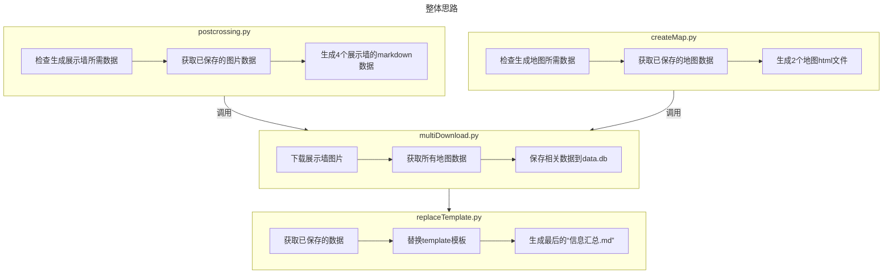

:::tip 前言
最近两个月又玩起了postcrossing，想着能否抓取网站数据，形成+整合自己的展示墙、地图、统计表、明信片故事，并在博客中显示。
:::
<Share colorful services="qq,weibo,qrcode"/>

## [成果展示（←点击查看）](/Arthur/postcrossing/信息汇总.html)

:::info 特点总结

项目地址：https://github.com/arthurfsy2/Postcrossing_map_generator

1. 展示墙：抓取官网的`/gallery`下的4个模块，分别展示。
2. 地图：参考官网的`/map`的样式，通过ClusterMap、Map这2个地图分别展示了聚合效果、散点展示效果，且每个地图都通过Geojson来标记收发国家的“足迹”。
3. 统计表：抓取官网的`/stats`下的3个模块，分别展示(图形是用echarts显示，统计表用markdown的表格功能。）
4. 故事墙（人工填写）：可读取项目的`./template/postcardStory.xlsx`,并将明信片ID与展示墙图片名称关联，可以在看到明信片正反面内容的同时，查看对应的英文/翻译内容。

:::

## 方法思路

总体而言，通过postcrossing.py生成展示墙、通过createMap.py生成地图，最后通过replateTemplate.py替换模板的内容，形成博客的`信息汇总.md`。

:::note 有效性
本项目原理是通过已登录账号的Cookie获取对应权限抓取数据，但是由于Cookie有效时间比较短，暂时无法通过Github Action实现自动化、定时更新数据。
:::

## 参考代码

### postcrossing信息汇总页
[参考代码](https://github.com/arthurfsy2/arthurfsy2.github.io/blob/main/src/Arthur/postcrossing/%E4%BF%A1%E6%81%AF%E6%B1%87%E6%80%BB.md)

