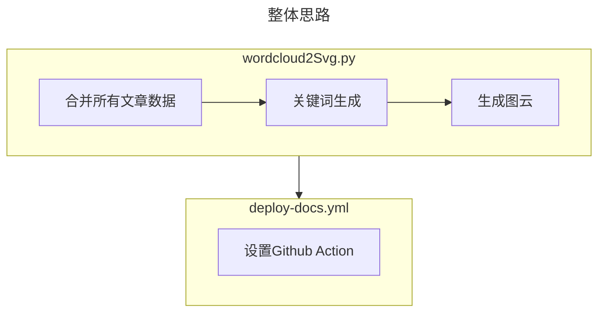

:::tip 前言
无意间看到一个[issue](https://github.com/vuepress-theme-hope/vuepress-theme-hope/issues/3372)有提及希望vuepress-theme-hope能新增echarts的词云，看了[paper-dragon](https://paper-dragon.github.io/)的成果，果然很赞。但是由于目前theme-hope兼容的echarts图表有限，因此采用了“另辟蹊径”的方法来实现动态获取博客所有文章关键词，然后在博客中动态显示（每git push一次就自动更新词云）
:::
<Share colorful services="qq,weibo,qrcode"/>
## 成果展示
:::note 说明
以下图片是一个svg图片，因此可以通过``的格式在文章的任意位置引用，且因为是矢量图，因此是在任何界面查看都是“高清无损”的。

:::

:::tip

本词云特点总结：

1. 矢量图，很清楚
2. 选了自认为效果还不错的繁体字体：[ Noto Serif TC ](https://fonts.google.com/noto/specimen/Noto+Serif+TC)
3. 在Git push更新项目时可通过Github Action自动运行生成词云的python文件，并与原有deploy-docs.yml合并在一起

:::


## 方法思路
总体来说，词云生成的思路如下流程图。
通过wordcloud2Svg.py生成图片，然后将该流程集成到deploy-docs.yml当中（与部署Github Page联合一起使用）


### 词云生成流程

wordcloud2Svg.py代码示例见后面章节
>具体可见本仓库的`src/.vuepress/public/scripts/wordcloud2Svg.py`

主要说明（具体说明见代码的注释）：
1. 遍历文章目录，将所有`.md`的文章内容合并为`contents`
2. 通过`jieba.analyse.textrank`来获取`contents`当中的关键词（通过topK设置关键词数量），并输出为`keyword_counts`
3. 通过`OpenCC`将`keyword_counts`转换为繁体（可根据自身喜好决定是否需要转换）
4. 通过`wordcloud.generate_from_frequencies()`来生成词云内容
5. 通过`wordcloud.to_svg(embed_font=True)`来生成svg内容
6. 将最终结果写入到`/assets/img/wordcloud.svg`文件当中

### 自动生成流程
deploy-docs.yml代码示例如下，具体可见本仓库的`.github/workflows/deploy-docs.yml`
主要说明（具体说明见代码的注释）：
1. 需要修改内容
将以下代码修改为你自己的github账号、邮箱
```
env:
  GITHUB_NAME: XXXX
  GITHUB_EMAIL: XXXX
```  
2. 在新增/修改文章然后push到Github时，将会运行Action脚本，实现动态生成

### 图片使用说明
如果action流程可正常运行，每次push后，将会在项目的`src/.vuepress/public/assets/img`路径下生成wordcloud.svg，此时在任意文章位置，你可以有以下3种引用图片方式：
```markdown
#vuepress-theme-hope内部资源路径，举例：


#github原始图片路径，举例：


#gitmirror免费CDN路径（githubusercontent换成gitmirror即可），举例：


```

## 参考代码

### wordcloud2Svg
> [参考代码](https://github.com/arthurfsy2/arthurfsy2.github.io/blob/main/src/.vuepress/public/scripts/wordcloud2Svg.py)


### deploy-docs

> [参考代码](https://github.com/arthurfsy2/arthurfsy2.github.io/blob/main/.github/workflows/deploy-docs.yml)

