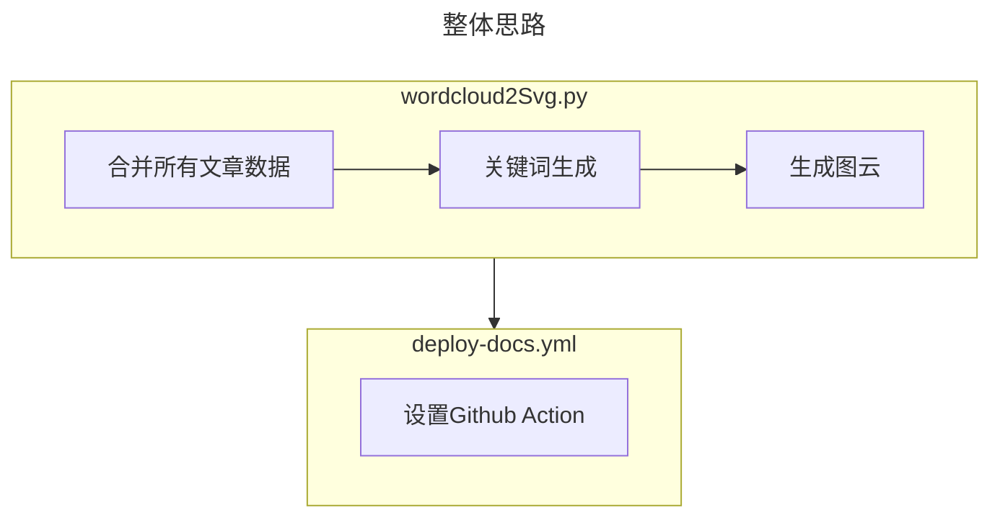

:::tip 前言
无意间看到一个[issue](https://github.com/vuepress-theme-hope/vuepress-theme-hope/issues/3372)有提及希望vuepress-theme-hope能新增echarts的词云，看了[paper-dragon](https://paper-dragon.github.io/)的成果，果然很赞。但是由于目前theme-hope兼容的echarts图表有限，因此采用了“另辟蹊径”的方法来实现动态获取博客所有文章关键词，然后在博客中动态显示（每git push一次就自动更新词云）
:::
<Share colorful services="qq,weibo,qrcode"/>
## 成果展示
:::note 说明
以下图片是一个svg图片，因此可以通过``的格式在文章的任意位置引用，且因为是矢量图，因此是在任何界面查看都是“高清无损”的。

:::

:::tip

本词云特点总结：

1. 矢量图，很清楚
2. 选了自认为效果还不错的繁体字体：[ Noto Serif TC ](https://fonts.google.com/noto/specimen/Noto+Serif+TC)
3. 在Git push更新项目时可通过Github Action自动运行生成词云的python文件，并与原有deploy-docs.yml合并在一起

:::


## 方法思路
总体来说，词云生成的思路如下流程图。
通过wordcloud2Svg.py生成图片，然后将该流程集成到deploy-docs.yml当中（与部署Github Page联合一起使用）


### 词云生成流程

wordcloud2Svg.py代码示例见后面章节
>具体可见本仓库的`src/.vuepress/public/scripts/wordcloud2Svg.py`

主要说明（具体说明见代码的注释）：
1. 遍历文章目录，将所有`.md`的文章内容合并为`contents`
2. 通过`jieba.analyse.textrank`来获取`contents`当中的关键词（通过topK设置关键词数量），并输出为`keyword_counts`
3. 通过`OpenCC`将`keyword_counts`转换为繁体（可根据自身喜好决定是否需要转换）
4. 通过`wordcloud.generate_from_frequencies()`来生成词云内容
5. 通过`wordcloud.to_svg(embed_font=True)`来生成svg内容
6. 将最终结果写入到`/assets/img/wordcloud.svg`文件当中

### 自动生成流程
deploy-docs.yml代码示例如下，具体可见本仓库的`.github/workflows/deploy-docs.yml`
主要说明（具体说明见代码的注释）：
1. 需要修改内容
将以下代码修改为你自己的github账号、邮箱
```
env:
  GITHUB_NAME: XXXX
  GITHUB_EMAIL: XXXX
```  
2. 在新增/修改文章然后push到Github时，将会运行Action脚本，实现动态生成

### 图片使用说明
如果action流程可正常运行，每次push后，将会在项目的`src/.vuepress/public/assets/img`路径下生成wordcloud.svg，此时在任意文章位置，你可以有以下3种引用图片方式：
```markdown
#vuepress-theme-hope内部资源路径，举例：


#github原始图片路径，举例：


#gitmirror免费CDN路径（githubusercontent换成gitmirror即可），举例：


```

## 参考代码

### wordcloud2Svg
:::details wordcloud2Svg.py
```python
import os
import jieba
from jieba import analyse
from wordcloud import WordCloud
from opencc import OpenCC

# 获取当前脚本文件所在目录
script_dir = os.path.dirname(os.path.abspath(__file__))

# 定义目录路径和输出路径

dir_path = os.path.normpath(os.path.join(script_dir, "../../../")) #本博客对应的是/src目录

output_path = os.path.normpath(os.path.join(script_dir, "../assets/img")) #本博客对应的是/src/.vuepress/public/assets/img目录

font_path = os.path.normpath(os.path.join(script_dir, "./font.otf")) #本博客对应的是/src/.vuepress/public/scripts/font.otf

output_path_svg = os.path.normpath(os.path.join(script_dir, "../assets/img/wordcloud.svg"))  #本博客对应的是/src/.vuepress/public/assets/img/wordcloud.svg

#print(f"dir_path:{dir_path}\n\noutput_path:{output_path}\n\nfont_path:{font_path}\n\noutput_path_svg:{output_path_svg}\n\n")

contents = ""
def merge_md_contents(folder_path):
    contents = ""
    for file in os.listdir(folder_path):
        file_path = os.path.join(folder_path, file)
        if os.path.isdir(file_path):
            contents += merge_md_contents(file_path)  # 递归遍历子文件夹并将内容合并
        elif file.endswith(".md"):
            with open(file_path, "r", encoding="utf-8") as f:
                file_content = f.read()
                contents += file_content
    return contents

contents = merge_md_contents(dir_path)
#with open(r"D:\Users\ArthurFsy\Documents\python脚本\rawPic\output.md", "w", encoding="utf-8") as f:
#                f.write(contents)
#print(contents)

# 使用jieba的textrank功能提取关键词
keywords = jieba.analyse.textrank(contents, topK=150, withWeight=False, allowPOS=('ns', 'n', 'vn', 'v'))
#print(f"keywords={keywords}")

# 创建 OpenCC 对象，指定转换方式为简体字转繁体字
converter = OpenCC('s2t.json')

# 统计每个关键词出现的次数
keyword_counts = {}
for keyword in keywords:
    count = contents.count(keyword)
    keyword = converter.convert(keyword) #简体转繁体，如果注释掉则保留为简体的内容
    keyword_counts[keyword] = count

#print(keyword_counts)


# 创建一个WordCloud对象，并设置字体文件路径和轮廓图像

wordcloud = WordCloud(width=1600, height=800, background_color="white", font_path=font_path)


# 生成词云
wordcloud.generate_from_frequencies(keyword_counts)

# 转换为svg格式输出
svg_image = wordcloud.to_svg(embed_font=True)
with open(output_path_svg, "w+", encoding='UTF8') as f:
    f.write(svg_image)
    print(f"已保存至{output_path_svg}")
```
:::


### deploy-docs

:::details deploy-docs.yml
```yml
name: 部署文档

on:
  push:
    branches:
      # make sure this is the branch you are using
      - main

env:
  GITHUB_NAME: XXXX
  GITHUB_EMAIL: XXXX

jobs:
  deploy-gh-pages:
    runs-on: ubuntu-latest
    steps:
      - name: Checkout
        uses: actions/checkout@v3
        with:
          fetch-depth: 0
          # if your docs needs submodules, uncomment the following line
          # submodules: true

      - name: 设置Python版本
        id: setup_python
        uses: actions/setup-python@v4
        with:
          python-version: "3.11"
          cache: pip
          cache-dependency-path: 'src/.vuepress/public/scripts/requirements.txt'

      - name: 安装python依赖
        run: |
          pip install -r src/.vuepress/public/scripts/requirements.txt

      - name: 生成图云
        run: |
          python src/.vuepress/public/scripts/wordcloud2Svg.py

      - name: 提交更新图云
        run: |
          git config --local user.email "${{ env.GITHUB_EMAIL }}"
          git config --local user.name "${{ env.GITHUB_NAME }}"
          git add .
          git commit -m "Moved to src/.vuepress/public/assets/img/wordcloud.svg"
          git push

      - name: 设置 Node.js 和 Yarn
        uses: actions/setup-node@v2.4.1
        with:
          node-version: 20.x
          cache: 'npm'
      - run: npm install -g yarn

      - name: 安装node依赖
        run: yarn install

      - name: 构建文档
        env:
          NODE_OPTIONS: --max_old_space_size=8192
        run: |-
          yarn run docs:build
          > src/.vuepress/dist/.nojekyll

      - name: 部署文档
        uses: JamesIves/github-pages-deploy-action@v4
        with:
          # This is the branch where the docs are deployed to
          branch: gh-pages
          folder: src/.vuepress/dist

```
:::

