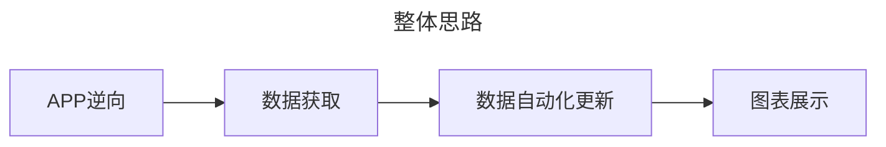

:::tip 前言
其实之前已经通过 node-red 实现了获取云麦好轻的数据，并在 Home Assistant 上展示家庭体重了，但是感觉自动化还是有点欠缺。刚好借着写 Blog 的时候发现 vuepress-theme-hope 支持 echarts 扩展，就想着尝试通过折线图实现。
:::

<Share colorful services="qq,weibo,qrcode"/>

## 成果展示

vuepress-theme-hope 内置的 markdownEnhance 功能，已经支持 echarts 图表（大部分）的展示了，可以通过 await+fetch 的方式引入 json 文件，并生成折线图。
效果如下：

新增：[在线导出数据](https://haoqing.4a1801.life/static/index.html)

::: important 说明
以上在线导出网站的前端，是通过 python 的 flask 库实现，整个服务是通过宝塔面板的 `网站——Python项目` 进行管理。
:::

::: echarts

```js
const data = await fetch(
  "https://raw.gitmirror.com/arthurfsy2/yunmai_weight_extract2json/main/weight_fsy.json"
).then((res) => res.json());

const data2 = await fetch(
  "https://raw.gitmirror.com/arthurfsy2/yunmai_weight_extract2json/main/weight_wyf.json"
).then((res) => res.json());

var a = data.map(function (item) {
  return item.weight;
});

var a2 = data2.map(function (item) {
  return item.weight;
});

function getAvg(arr) {
  var sum = 0;
  for (var i = 0; i < arr.length; i++) {
    sum += parseInt(arr[i]);
  }
  var avg = sum / arr.length;
  return avg;
}

const option = {
  tooltip: {
    trigger: "axis",
  },
  grid: {
    left: "5%",
    right: "15%",
    bottom: "10%",
  },
  xAxis: [
    {
      data: data.map(function (item) {
        return item.createTime;
      }),
    },
    {
      data: data2.map(function (item) {
        return item.createTime;
      }),
    },
  ],
  yAxis: [
    {
      type: "value",
      scale: true,
      name: "体重",
      position: "left",
      alignTicks: true,
      axisLine: {
        show: true,
      },
      axisLabel: {
        formatter: "{value}kg",
      },
    },
  ],
  toolbox: {
    right: 10,
    feature: {
      restore: {},
      saveAsImage: {},
    },
  },
  dataZoom: [
    {
      start: 80,
    },
    {
      type: "inside",
    },
  ],
  visualMap: [
    {
      seriesIndex: 0,
      top: 50,
      right: 10,

      pieces: [
        {
          lte: 59.94,
          label: "偏瘦",
          color: "grey",
        },
        {
          gt: 59.94,
          lte: 77.76,
          label: "正常",
          color: "green",
        },
        {
          gt: 77.76,
          lte: 90.72,
          label: "偏胖",
          color: "orange",
        },
        {
          gt: 90.72,

          label: "肥胖",
          color: "red",
        },
      ],
      outOfRange: {
        color: "#999",
      },
    },
    {
      seriesIndex: 1,
      down: 50,
      right: 10,
      pieces: [
        {
          lte: 53.465,
          label: "偏瘦",
          color: "grey",
        },
        {
          gt: 53.465,
          lte: 69.36,
          label: "正常",
          color: "green",
        },
        {
          gt: 69.36,
          lte: 80.92,
          label: "偏胖",
          color: "orange",
        },
        {
          gt: 80.92,

          label: "肥胖",
          color: "red",
        },
      ],
      outOfRange: {
        color: "#999",
      },
    },
  ],
  series: [
    {
      name: "Mr.Feng体重",
      type: "line",
      xAxisIndex: 0,
      yAxisIndex: 0,
      symbol: "none",
      smooth: true,
      data: data.map(function (item) {
        return item.weight;
      }),

      markLine: {
        silent: false,
        lineStyle: {
          color: "#333",
        },
        data: [
          {
            yAxis: getAvg(a).toFixed(2),
          },
        ],
      },
    },
    {
      name: "Ms.Wu体重",
      type: "line",
      xAxisIndex: 1,
      yAxisIndex: 0,
      symbol: "none",
      smooth: true,
      data: data2.map(function (item) {
        return item.weight;
      }),

      markLine: {
        silent: false,
        lineStyle: {
          color: "#333",
        },
        data: [
          {
            yAxis: getAvg(a2).toFixed(2),
          },
        ],
      },
    },
  ],
};
```

:::

## 方法思路

总体来说，数据处理的思路是:



### APP 逆向

其中对我而言最困难的就是“APP 逆向”这个步骤，毕竟对抓包也只是略懂皮毛，后来花了 200 大洋找了大佬逆向了好轻 APP 登陆算法，才完成最关键也是最开始的一步。

### 数据获取

#### Javascript

数据获取其实有很多种方式，像我之前是通过 node-red 来进行数据处理、清洗，然后转换为 HA 的插件所支持的数据格式，感兴趣的可以看这里 →[【node-red 长期稳定】云麦好轻 app 体重数据接入 HA](https://bbs.hassbian.com/thread-20999-1-1.html)

#### Python

其实写 python 脚本的时候。是照着 node-red 的流程来写的，编程小白在这里又一次借鉴了 ChatGPT 的神秘力量完成了编程，并解决了 RSA 加密这一最关键的一步[^1]。

### 数据化自动更新

如果是希望数据采集更稳定和方便，那可以借助 Github Action 了，可设置为每天定时运行 workflows，进行定期取数。具体使用方法可看这里 →[arthurfsy2/yunmai_weight_extract2json](https://github.com/arthurfsy2/yunmai_weight_extract2json)

## 参考代码

:::tip 双人体重
修改以下代码的
`const data = await fetch()`对应的链接、标题名称等内容即可。
:::

````md
:::echarts

```js
const data = await fetch(
  "https://raw.gitmirror.com/arthurfsy2/yunmai_weight_extract2json/main/weight_fsy.json"
).then((res) => res.json());

const data2 = await fetch(
  "https://raw.gitmirror.com/arthurfsy2/yunmai_weight_extract2json/main/weight_wyf.json"
).then((res) => res.json());

var a = data.map(function (item) {
  return item.weight;
});

var a2 = data2.map(function (item) {
  return item.weight;
});

function getAvg(arr) {
  var sum = 0;
  for (var i = 0; i < arr.length; i++) {
    sum += parseInt(arr[i]);
  }
  var avg = sum / arr.length;
  return avg;
}

const option = {
  tooltip: {
    trigger: "axis",
  },
  grid: {
    left: "5%",
    right: "15%",
    bottom: "10%",
  },
  xAxis: [
    {
      data: data.map(function (item) {
        return item.createTime;
      }),
    },
    {
      data: data2.map(function (item) {
        return item.createTime;
      }),
    },
  ],
  yAxis: [
    {
      type: "value",
      scale: true,
      name: "体重",
      position: "left",
      alignTicks: true,
      axisLine: {
        show: true,
      },
      axisLabel: {
        formatter: "{value}kg",
      },
    },
  ],
  toolbox: {
    right: 10,
    feature: {
      restore: {},
      saveAsImage: {},
    },
  },
  dataZoom: [
    {
      start: 80,
    },
    {
      type: "inside",
    },
  ],
  visualMap: [
    {
      seriesIndex: 0,
      top: 50,
      right: 10,

      pieces: [
        {
          lte: 59.94,
          label: "偏瘦",
          color: "grey",
        },
        {
          gt: 59.94,
          lte: 77.76,
          label: "正常",
          color: "green",
        },
        {
          gt: 77.76,
          lte: 90.72,
          label: "偏胖",
          color: "orange",
        },
        {
          gt: 90.72,

          label: "肥胖",
          color: "red",
        },
      ],
      outOfRange: {
        color: "#999",
      },
    },
    {
      seriesIndex: 1,
      down: 50,
      right: 10,
      pieces: [
        {
          lte: 53.465,
          label: "偏瘦",
          color: "grey",
        },
        {
          gt: 53.465,
          lte: 69.36,
          label: "正常",
          color: "green",
        },
        {
          gt: 69.36,
          lte: 80.92,
          label: "偏胖",
          color: "orange",
        },
        {
          gt: 80.92,

          label: "肥胖",
          color: "red",
        },
      ],
      outOfRange: {
        color: "#999",
      },
    },
  ],
  series: [
    {
      name: "Mr.Feng体重",
      type: "line",
      xAxisIndex: 0,
      yAxisIndex: 0,
      symbol: "none",
      smooth: true,
      data: data.map(function (item) {
        return item.weight;
      }),

      markLine: {
        silent: false,
        lineStyle: {
          color: "#333",
        },
        data: [
          {
            yAxis: getAvg(a).toFixed(2),
          },
        ],
      },
    },
    {
      name: "Ms.Wu体重",
      type: "line",
      xAxisIndex: 1,
      yAxisIndex: 0,
      symbol: "none",
      smooth: true,
      data: data2.map(function (item) {
        return item.weight;
      }),

      markLine: {
        silent: false,
        lineStyle: {
          color: "#333",
        },
        data: [
          {
            yAxis: getAvg(a2).toFixed(2),
          },
        ],
      },
    },
  ],
};
```

:::
````

[^1]: 原来的 node-red 是囿于自身 IT 技术原因，没办法实现直接输入手机、账号就可以直接获取数据，只能通过 `cyberchef`手动加密，所以说起来通过 node-red 的 flow 来实现的功能还不算特别完善。
